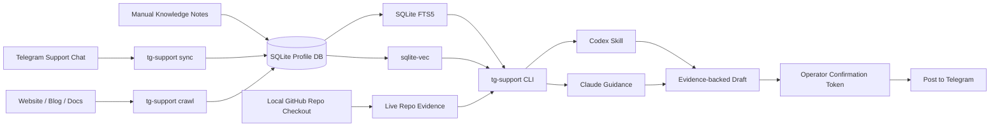

# Telegram Support Agent

[](https://www.python.org/)
[](LICENSE)
[](#why-this-shape)
[](#codex-and-claude)
[](#codex-and-claude)


A local-first support agent for founders and maintainers who answer users in Telegram.

It lets Codex or Claude search your Telegram support history, website/docs, manual support notes, and optional repo evidence. It can answer support analytics questions and draft evidence-backed replies, but it only posts to Telegram after explicit operator confirmation.

**No hosted helpdesk. No SaaS support inbox. Telegram sessions, SQLite metadata, retrieval indexes, drafts, and confirmation records stay on your machine.**

## Demo

Search Telegram support history, local docs, and repo evidence. Draft a reply. Post only after explicit confirmation.

https://github.com/user-attachments/assets/<uploaded-demo-video-id>

## Who this is for

This is for people who already run support inside Telegram:
- solo founders answering users directly
- maintainers of developer tools
- small SaaS teams without a hosted helpdesk
- support engineers who need local searchable context
- projects where support data should stay on the operator's machine

## What it does

- Syncs a configured Telegram support chat into a local profile.
- Crawls website/blog/docs seeds for support knowledge.
- Builds local hybrid search with SQLite FTS5 + sqlite-vec.
- Uses local embeddings for semantic retrieval.
- Searches live repository evidence for product/API/debugging questions.
- Creates evidence-backed reply drafts.
- Requires explicit confirmation before posting to Telegram.
- Works from Codex, Claude, or the `tg-support` CLI.

## Not a Telegram bot

This project is not designed to autonomously answer users.

It is an operator-assist workflow: the agent can search, summarize, and draft replies, but posting requires an explicit confirmation. This keeps the risky action — writing to Telegram — behind a deterministic local CLI boundary.

## Install

For Codex, add the plugin marketplace and install the plugin:

```bash
codex plugin marketplace add igorrendulic/tg-customer-support-plugin
codex plugin add telegram-support-agent@tg-customer-support-plugin
```

## Quickstart

After install, open Codex in the workspace where you want to use the support agent and ask it to use the `telegram-support` skill, for example:

```text
Use the telegram-support skill to set up profile default for @my-support-chat with seed https://example.com.
```

The first time the workflow runs the bundled `scripts/tg-support` helper, it creates its own runtime environment, installs the Telegram, browser-rendering, and retrieval dependencies, and installs Chromium for Playwright. Retrieval uses SQLite FTS5, sqlite-vec, and local `BAAI/bge-small-en-v1.5` embeddings. The first index build may need to download or load the BGE Small model through `sentence-transformers`; after that, search runs against the local profile index.

Then ask Codex to log in, sync Telegram history, crawl the configured seed, and build the local index:

```text
Use the telegram-support skill to log in and build the local corpus for profile default.
```

Codex will first check profile readiness. If Telegram API credentials are missing, it will ask you for the API ID and API hash from `https://my.telegram.org`, store them under the local profile, and continue setup from there.

Once indexing finishes, ask normal support questions in Codex:

```text
Use the telegram-support skill to find recent passkey setup issues.
Use the telegram-support skill to draft a reply for message 123.
```

To run the CLI directly outside Codex:

```bash
git clone https://github.com/igorrendulic/tg-customer-support-plugin.git
cd tg-customer-support-plugin
scripts/tg-support --help
```

By default, the auto-created environment lives under `~/.tg-support/.venv`. Set `TG_SUPPORT_VENV` to put it somewhere else.

The package also exposes a `tg-support` console script inside that auto-created environment:

```bash
~/.tg-support/.venv/bin/tg-support --help
```

### Development Install

For local development, clone the repo and install the package with dev and retrieval dependencies:

```bash
git clone <repo-url>
cd tg-support-plugin
python3 -m venv .venv
.venv/bin/pip install -e ".[retrieval,dev]"
```

Add Telegram and browser-rendering adapters when you need real Telegram login or Playwright crawling:

```bash
.venv/bin/pip install -e ".[telegram,render,retrieval,dev]"
```

## Use

Create a local profile with one Telegram chat. Website or blog seeds are optional:

```bash
scripts/tg-support --profile default setup \
  --chat my-support-chat
```

Optionally add website or blog seeds for public support resources:

```bash
scripts/tg-support --profile default setup \
  --chat my-support-chat \
  --seed https://example.com/blog
```

Optionally add a GitHub repository and branch for code-grounded behavior or debugging answers. The branch defaults to `main` when omitted. This uses your existing local `git` or `gh` authentication; do not paste GitHub credentials into the support workflow.

```bash
scripts/tg-support --profile default setup \
  --chat my-support-chat \
  --seed https://example.com/blog \
  --repository owner/project
```

Then build the local corpus:

```bash
scripts/tg-support --profile default credentials --api-id 123456
scripts/tg-support --profile default login
scripts/tg-support --profile default sync
scripts/tg-support --profile default crawl
scripts/tg-support --profile default index
scripts/tg-support --profile default status
```

`crawl` follows same-scope links two levels deep by default. Use `--depth 0` to crawl only configured seed URLs.

`index` creates source-linked documents, an FTS5 exact-term index, and a 384-dimensional sqlite-vec vector index for `BAAI/bge-small-en-v1.5`. If the retrieval dependencies, embedding model, or local SQLite extension loading are not available, the command returns JSON with `ok: false`, the SQLite version when relevant, and `next_action` instead of silently falling back to weaker search.

Ask questions or prepare a reply draft:

```bash
scripts/tg-support --profile default search "password reset issues"
scripts/tg-support --profile default repo-evidence "account transfer api"
scripts/tg-support --profile default stats active-users
scripts/tg-support --profile default draft-context --user alice
scripts/tg-support --profile default draft-create --message-id 123 --text "Thanks, try the reset link here..."
```

Repository Evidence is live and branch-specific rather than indexed. Use it for product-behavior, capability, API-behavior, or debugging questions. If the checkout cannot refresh, the CLI returns a stale warning so the agent can tell the operator that cited code may be outdated.

Save dated support knowledge through Codex after reviewing the parsed fields, or directly through the CLI after the operator has confirmed the note:

```bash
scripts/tg-support --profile default knowledge-add \
  --text "Account transfers were discontinued. Users must register a new email address." \
  --effective-date 2026-04-02 \
  --caveats "Old email addresses are quarantined until further notice."
scripts/tg-support --profile default index
```

Active manual knowledge can appear in search or draft evidence ahead of older Telegram and web sources. If returned JSON includes `conflicts`, show the manual note and the competing evidence to the operator before answering or drafting.

Posting is intentionally a separate confirmed action. Show the operator the exact draft, target, and evidence first, then use the generated post or cancel token:

```bash
scripts/tg-support --profile default confirm <post_or_cancel_token>
```

Local profile data lives outside the source tree by default:

```text
~/.tg-support/profiles/<profile>/
```

That profile directory contains the profile config, optional repository checkout state, Telegram API credentials, Telegram session file, SQLite database, and rebuildable indexes. Treat it as sensitive local state.

Set `TG_SUPPORT_HOME` to move profile data elsewhere.

Existing local profiles created with an older embedding model must be recreated or edited before use. The CLI intentionally rejects unsupported `embedding_model` values instead of mixing incompatible vector dimensions in the same profile.

## Architecture



## Codex And Claude

The Codex skill lives in `skills/telegram-support/`. It uses the same `scripts/tg-support` commands as the CLI examples above and treats JSON CLI output as the source of truth for evidence, conflicts, draft IDs, and confirmation tokens.

Claude companion guidance is in `agents/claude.md` and `docs/claude-usage.md`. Claude should use the same local CLI and must not post directly or infer confirmation from casual approval.

## Why This Shape

The key safety boundary is deliberate: agent prompts can retrieve evidence and draft text, but only deterministic CLI code can consume a confirmation token and write to Telegram.

SQLite is the durable local metadata store. The SQLite Hybrid Search Index is a rebuildable projection linked back to Telegram messages, crawled pages, and Manual Knowledge Notes: FTS5 recovers exact product and policy terms, sqlite-vec handles vector candidates with local `BAAI/bge-small-en-v1.5` embeddings, and answers cite source records instead of relying on agent memory.

## Development

Install dev dependencies:

```bash
python3 -m venv .venv
.venv/bin/pip install -e ".[retrieval,dev]"
```

Run the test suite:

```bash
.venv/bin/pytest
```

Run lint checks:

```bash
uv run --with ruff ruff check .
```

Useful project files:

- `tg_support/cli.py` defines the command boundary.
- `tg_support/storage/schema.py` defines the local SQLite shape.
- `tg_support/support/drafting.py` and `tg_support/support/posting.py` own the draft and confirmation flow.
- `skills/telegram-support/SKILL.md` defines the Codex operator workflow.
- `docs/solutions/` captures durable architecture and workflow learnings.
- `CONCEPTS.md` defines project vocabulary.

See `CONTRIBUTING.md` for contribution guidelines.
