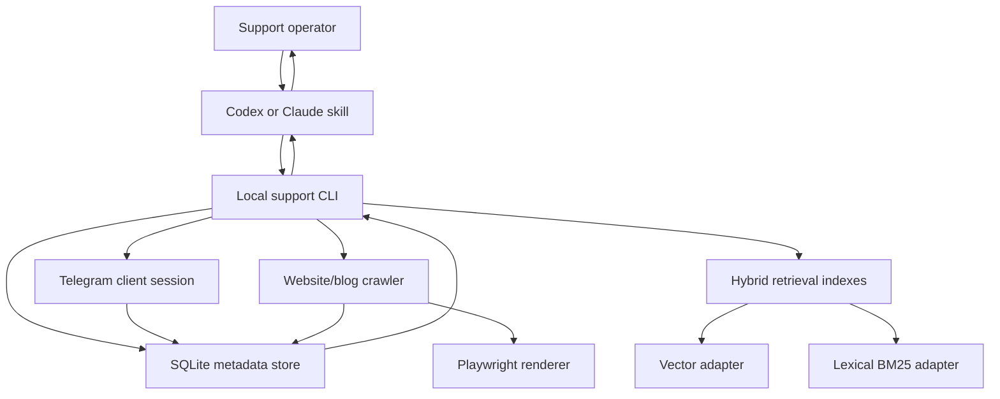
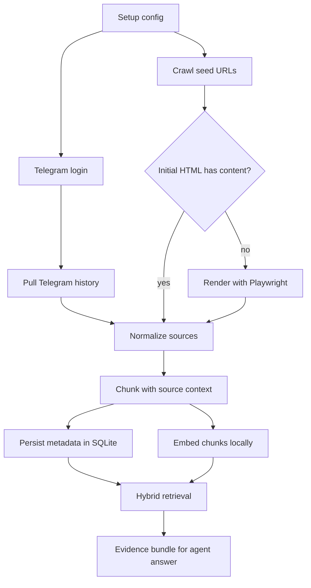
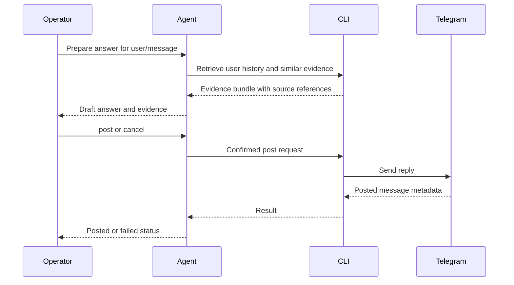

# feat: Build Telegram support agent plugin

## Summary

Build a greenfield local Telegram support agent package with a shared Python core and thin Codex/Claude integration surfaces. The first version lets a single support operator log into Telegram once, index one configured support chat plus website/blog resources, ask support analytics questions, draft replies, and post only after explicit confirmation.

---

## Problem Frame

The operator currently reads Telegram manually, asks ChatGPT to draft responses from remembered context, adds relevant resource links, and copy-pastes the final answer as a Telegram reply. The new plugin should make that workflow local, searchable, repeatable, and safer without becoming a multi-agent helpdesk or cloud support system.

---

## Requirements

**Packaging and setup**

- R1. Provide an installable Codex plugin package with local helper scripts and no MCP server.
- R2. Provide a Claude-compatible companion surface that reuses the same local core without requiring identical marketplace mechanics.
- R3. Setup accepts a generic Telegram chat identifier and website/blog seed URLs without hard-coded project values.
- R4. Setup performs a one-time local Telegram login and stores a local session for future reads and confirmed writes.

**Ingestion and storage**

- R5. Ingest Telegram history with chat, author, timestamp, message, reply/thread, and source identifiers.
- R6. Crawl configured website/blog resources with URL, title, extracted text, crawl metadata, and chunk references.
- R7. Store source metadata and retrieval references in SQLite so every retrieved item can be traced back to Telegram or a URL.
- R8. Keep embedding model and vector-store choices configurable enough to allow later migration.
- R9. Support browser-rendered crawling for JavaScript app-shell pages where article links or body text are not present in initial HTML.

**Retrieval and answering**

- R10. Combine lexical BM25-style retrieval, dense vector retrieval, and reciprocal-rank fusion or equivalent hybrid ranking.
- R11. Chunk webpages and long Telegram contexts while preserving enough surrounding conversation context for answer quality.
- R12. Support freeform local-corpus questions such as recurring complaints, helpful users, repeated topics, and link usage.
- R13. Support direct CLI statistics for message counts, active users, replied-to users, repeated topics, and commonly used links.

**Drafting and posting**

- R14. Prepare a draft reply for a target user or message using the target user's history, similar prior support conversations, and relevant resource links.
- R15. Show the proposed response, target chat, target user/message when available, posting mode, and evidence before any Telegram write.
- R16. Post to Telegram only after explicit operator confirmation and never auto-post or silently retry duplicate posts.

---

## Key Technical Decisions

- KTD1. **Shared Python core with thin wrappers:** Python should own Telegram client access, crawling, SQLite, embeddings, retrieval, statistics, and posting. Codex and Claude integrations stay as skills/commands that call the same CLI because Telegram and ML/retrieval ergonomics are better served by Python than by duplicating logic in plugin glue.
- KTD2. **No MCP in the first version:** The integrations invoke local commands and read local outputs rather than exposing a Telegram MCP server. This preserves the user's explicit non-goal while still making the workflow usable from agent CLIs.
- KTD3. **Telethon-style user session model:** Use a Telegram client library that supports local user login, history reads, entity resolution, and reply posting. A user-session client fits the one-operator workflow better than a bot token because support chats may require access to existing user-visible history and reply behavior.
- KTD4. **SQLite as the source-of-truth metadata store:** SQLite owns chats, users, messages, pages, chunks, indexing runs, and post confirmations. Vector/BM25 indexes are rebuildable projections linked back to SQLite rows.
- KTD5. **HTTP-first crawler with Playwright rendering adapter:** Static HTML extraction should remain the default path, but JavaScript app-shell pages must be detected and crawled through a browser-rendered adapter. `https://mailio.io/blog` currently returns only a root div plus JS bundles in initial HTML, so Mailio's own blog validates that browser rendering is required for at least some configured resources.
- KTD6. **Qdrant Edge behind a retrieval adapter:** Plan for Qdrant Edge as the first local vector layer because it targets embedded local search and pairs with FastEmbed/BM25 guidance, but keep the retrieval adapter boundary explicit because Edge is still a fast-moving dependency.
- KTD7. **Configurable local embedding model:** Default to a current Hugging Face-compatible retrieval model selected during implementation, with the model name stored in index metadata. The plan should not hard-code a model into schemas or prompts.
- KTD8. **Agent judgment stops at draft and confirmation:** The agent can gather evidence, draft, and ask for confirmation, but the deterministic CLI performs the final write only after a confirmed action token or equivalent explicit operator input.

---

## High-Level Technical Design

### Component topology



### Indexing and query flow



### Confirmed reply flow



---

## Output Structure

```text
.codex-plugin/
  plugin.json
agents/
  openai.yaml
  claude.md
skills/
  telegram-support/
    SKILL.md
    references/
      reply-workflow.md
      analytics-workflow.md
scripts/
  tg-support
tg_support/
  __init__.py
  cli.py
  config.py
  telegram_client.py
  crawler.py
  renderer.py
  storage/
    db.py
    schema.py
    migrations/
  indexing/
    chunking.py
    embeddings.py
    lexical.py
    vector.py
    hybrid.py
  support/
    context.py
    stats.py
    drafting.py
    posting.py
tests/
  test_cli_setup.py
  test_config.py
  test_telegram_client.py
  test_crawler.py
  test_renderer.py
  test_storage.py
  test_chunking.py
  test_hybrid_retrieval.py
  test_stats.py
  test_posting_confirmation.py
docs/
  setup.md
  claude-usage.md
```

The tree shows the expected shape. Implementation may adjust file names if a package scaffold or dependency requires it, but the boundaries should remain stable.

---

## Scope Boundaries

### In Scope

- One local operator account and one configured support chat per setup profile.
- Telegram history ingestion, website/blog crawling, hybrid search, analytics, draft replies, and confirmed Telegram posting.
- Codex plugin packaging through a marketplace-compatible plugin layout.
- Claude-compatible instructions/commands over the same local CLI.

### Deferred to Follow-Up Work

- Multiple support operators, shared assignments, or team inbox semantics.
- Private-chat response generation beyond leaving the local core extensible for it.
- Cloud sync, hosted dashboards, or shared analytics.
- Automated scheduled indexing beyond a manual or simple refresh command.

### Outside This Product's Identity

- MCP server integration in the first version.
- Reusing an already logged-in Telegram desktop/mobile session.
- Automatic unconfirmed posting.
- Hard-coded Mailio channel names, URLs, policies, or answer style.
- Full ticketing/helpdesk replacement.

---

## System-Wide Impact

This plan introduces user-authenticated Telegram access, local persisted support data, locally generated embeddings, and externally visible posting from an agent-assisted workflow. The implementation must treat Telegram session files, SQLite databases, and crawl/index artifacts as local sensitive state. It must also keep agent-accessible capabilities aligned with deterministic local commands so the agent cannot bypass confirmation for externally visible actions.

The local profile directory is part of the product boundary. Setup, reset, sync, and rebuild commands need predictable behavior when a profile exists, when a session is expired, when a database is migrated, and when an index is stale. The agent-facing workflows should report those states as actionable operator prompts rather than attempting hidden repair.

---

## Risks & Dependencies

- **Telegram API and account risk:** User-session automation can be rate-limited or restricted by Telegram behavior and account standing. Mitigate with conservative history windows, refresh limits, and clear failure messages.
- **Local credential and data exposure:** Telegram session files and support history may contain private user data. Mitigate with a profile directory outside the plugin source tree, documentation for local storage paths, and no accidental inclusion of profile data in plugin packaging.
- **Qdrant Edge maturity:** Edge is suitable for local embedded retrieval planning, but its API and packaging may shift. Mitigate with a vector adapter and a fallback path that can rebuild indexes from SQLite metadata.
- **Embedding model churn:** Local embedding recommendations change. Mitigate by storing model identity in index metadata and keeping chunk/source tables independent of embedding dimensions.
- **Crawler scope creep:** Website/blog crawling can accidentally expand beyond the user's resources. Mitigate with explicit seed scopes, robots-aware defaults where practical, and crawl summaries.
- **Browser rendering dependency:** Playwright adds install size, runtime complexity, and browser availability requirements. Mitigate with HTTP-first extraction, `render: auto|always|never` seed configuration, and optional integration tests for rendered pages.
- **Index drift:** Telegram history and crawled pages can change after indexing. Mitigate with index run metadata, stale-index warnings, and rebuild commands that preserve source records.
- **Posting safety:** A malformed command or duplicated confirmation could post the wrong reply. Mitigate with confirmation records, target display, idempotency checks, and tests around cancellation and duplicate handling.

---

## Implementation Units

### U1. Package scaffold and shared CLI shell

- **Goal:** Create the Python package, console entrypoint, plugin manifest, and Codex/Claude integration skeletons.
- **Requirements:** R1, R2, R3.
- **Dependencies:** None.
- **Files:** `.codex-plugin/plugin.json`, `agents/openai.yaml`, `agents/claude.md`, `skills/telegram-support/SKILL.md`, `scripts/tg-support`, `tg_support/__init__.py`, `tg_support/cli.py`, `tg_support/config.py`, `tests/test_cli_setup.py`, `tests/test_config.py`, `docs/setup.md`, `docs/claude-usage.md`.
- **Approach:** Define a single local CLI entrypoint with subcommands for setup, sync, search, stats, draft, and confirmed post. Keep skill files as orchestration instructions that call the CLI and require evidence display before posting.
- **Patterns to follow:** Codex plugin manifest conventions from the current Codex manual; Claude companion docs should use Claude's documented plugin or command conventions available at implementation time.
- **Test scenarios:** 
  - Running setup validation with a chat handle and seed URL stores a normalized local config without hard-coded project values.
  - Local profile paths resolve outside the plugin source tree and are excluded from distributable package metadata.
  - Missing required setup inputs produces a clear validation error and does not create a partial profile.
  - The Codex skill instructions reference the local CLI and include the confirmation boundary for posting.
  - The Claude companion instructions reference the same CLI commands rather than duplicating workflow logic.
- **Verification:** A fresh checkout exposes the CLI entrypoint, validates config, and presents install/usage docs for both Codex and Claude surfaces.

### U2. Telegram session, chat resolution, and history ingestion

- **Goal:** Implement one-time local Telegram login, chat/entity resolution, chat type detection, and initial history ingestion.
- **Requirements:** R3, R4, R5.
- **Dependencies:** U1.
- **Files:** `tg_support/telegram_client.py`, `tg_support/storage/db.py`, `tg_support/storage/schema.py`, `tg_support/storage/migrations/`, `tg_support/cli.py`, `tests/test_telegram_client.py`, `tests/test_storage.py`.
- **Approach:** Store session files in a local profile directory outside the plugin source tree, resolve input handles/links to Telegram entities, record chat metadata, and ingest messages with author and reply identifiers. Use dependency boundaries that allow Telegram calls to be mocked in tests.
- **Execution note:** Add tests against a fake Telegram client before wiring real client calls.
- **Test scenarios:**
  - A bare handle, `@handle`, and `t.me/handle` normalize to the same configured chat input.
  - A resolved group/supergroup/channel-like entity persists chat type and stable identifiers.
  - History ingestion stores messages with author, timestamp, text, message ID, and reply ID when present.
  - Login cancellation or invalid credentials leaves no usable session marked as active.
  - Telegram rate-limit or permission errors are surfaced without corrupting previously ingested data.
- **Verification:** The ingestion command can populate SQLite from a mocked Telegram history and can be swapped to a real login during manual verification.

### U3. Website/blog crawler and source normalization

- **Goal:** Crawl configured public resources and persist canonical page metadata and extracted text for retrieval.
- **Requirements:** R3, R6, R7, R9.
- **Dependencies:** U1.
- **Files:** `tg_support/crawler.py`, `tg_support/renderer.py`, `tg_support/storage/db.py`, `tg_support/storage/schema.py`, `tg_support/cli.py`, `tests/test_crawler.py`, `tests/test_renderer.py`, `tests/test_storage.py`.
- **Approach:** Crawl from explicit seed URLs with bounded scope controls, extract readable text from static HTML when possible, and fall back to Playwright rendering for app-shell pages where initial HTML lacks article links or body text. Keep rendering configurable per seed with `auto`, `always`, and `never` modes.
- **Test scenarios:**
  - A seed URL within scope is fetched, normalized, and persisted with URL, title, extracted text, and crawl timestamp.
  - Duplicate URLs with fragments or trailing-slash variants map to one canonical page record.
  - An app-shell page with only a root element and script bundles triggers Playwright rendering in `auto` mode.
  - A seed configured with `render: never` reports empty extraction instead of invoking Playwright.
  - A Playwright-rendered fixture page persists discovered article links and rendered body text.
  - Out-of-scope links are skipped and reported in the crawl summary.
  - Fetch failures are recorded per URL without aborting the entire crawl.
  - Empty or unreadable pages do not create retrievable chunks.
- **Verification:** Static and rendered fixture sites can be crawled into SQLite with stable source records and useful crawl summaries.

### U4. SQLite schema, migrations, and source traceability

- **Goal:** Define durable local metadata tables and migration mechanics that link every retrieval item to Telegram or web source records.
- **Requirements:** R5, R6, R7, R8.
- **Dependencies:** U2, U3.
- **Files:** `tg_support/storage/db.py`, `tg_support/storage/schema.py`, `tg_support/storage/migrations/`, `tests/test_storage.py`.
- **Approach:** Model source records, chunks, index runs, embedding model metadata, vector references, lexical references, draft records, confirmation records, and posted-message metadata. Treat indexes as rebuildable projections and SQLite as the durable source of truth.
- **Test scenarios:**
  - Fresh database initialization creates the expected current schema version.
  - Re-running initialization is idempotent.
  - Migrating an existing database preserves chat, page, message, chunk, and confirmation records.
  - Chunk records can link back to Telegram messages and web pages with source-specific metadata intact.
  - Index run records capture embedding model identity and index version.
  - Deleting or rebuilding an index projection does not delete source records.
- **Verification:** Storage tests prove traceability from retrieval chunk to original Telegram message or URL.

### U5. Chunking, embeddings, and hybrid retrieval

- **Goal:** Build a local retrieval pipeline with chunking, configurable embeddings, lexical search, vector search, and rank fusion.
- **Requirements:** R8, R10, R11, R14.
- **Dependencies:** U4.
- **Files:** `tg_support/indexing/chunking.py`, `tg_support/indexing/embeddings.py`, `tg_support/indexing/lexical.py`, `tg_support/indexing/vector.py`, `tg_support/indexing/hybrid.py`, `tg_support/cli.py`, `tests/test_chunking.py`, `tests/test_hybrid_retrieval.py`.
- **Approach:** Chunk web pages and Telegram conversation windows into retrievable units, embed chunks locally, index lexical terms, and return fused results with source metadata. Hide Qdrant Edge behind the vector adapter so a fallback vector implementation can be introduced without changing upstream command behavior.
- **Execution note:** Start with deterministic fixture retrieval tests before tuning model or ranking details.
- **Test scenarios:**
  - A long webpage is split into chunks that preserve URL/title references and stable ordering.
  - A Telegram reply chain produces chunks that include enough neighboring context to interpret the reply.
  - Hybrid search returns lexical-only, vector-only, and fused results with stable source references.
  - Reciprocal-rank fusion favors items that appear in both lexical and dense result sets.
  - Changing the embedding model identity creates or requires a separate index run rather than mixing incompatible vectors.
  - A stale index run is detected when source chunks have changed after the latest successful index.
  - Vector adapter failure degrades to a clear error or lexical-only fallback according to the configured mode.
- **Verification:** Fixture queries retrieve expected Telegram and web evidence and expose source IDs usable by drafting/statistics code.

### U6. Analytics and stats commands

- **Goal:** Implement direct CLI statistics and freeform evidence preparation for support analytics questions.
- **Requirements:** R12, R13.
- **Dependencies:** U4, U5.
- **Files:** `tg_support/support/stats.py`, `tg_support/support/context.py`, `tg_support/cli.py`, `tests/test_stats.py`, `tests/test_hybrid_retrieval.py`.
- **Approach:** Use SQLite for structured counts and hybrid retrieval for topic/evidence bundles. Return machine-readable summaries that agent skills can turn into prose while preserving source references.
- **Test scenarios:**
  - Message count since a date filters by timestamp and chat.
  - Most active users ranks by message count with stable tie handling.
  - Most replied-to users uses reply metadata rather than raw mention text.
  - Repeated-topic analysis returns evidence chunks and does not claim unsupported clusters when the corpus is too small.
  - Link usage analysis counts links from support answers and web resources separately.
- **Verification:** CLI stats commands produce deterministic output from seeded fixture data and include enough metadata for an agent answer.

### U7. Draft reply context assembly

- **Goal:** Build the command that prepares an evidence bundle for a target user or message and supports agent-authored draft replies.
- **Requirements:** R12, R14, R15.
- **Dependencies:** U5, U6.
- **Files:** `tg_support/support/context.py`, `tg_support/support/drafting.py`, `tg_support/cli.py`, `skills/telegram-support/references/reply-workflow.md`, `tests/test_hybrid_retrieval.py`, `tests/test_cli_setup.py`.
- **Approach:** Resolve a target username/message to local history, retrieve similar Telegram issues and relevant web resources, and emit an evidence bundle with concise snippets, URLs/message references, and target metadata. The agent writes the natural-language response from this bundle rather than the CLI generating final prose itself.
- **Test scenarios:**
  - Draft context for a known username includes recent user history and similar prior issues.
  - Draft context for a message ID includes thread/reply context when available.
  - Relevant website/blog chunks are included with source URLs.
  - Unknown users or missing local history produce an actionable sync/search suggestion.
  - Evidence output is bounded so it can fit into an agent prompt without losing source traceability.
- **Verification:** The skill can ask the CLI for context and produce a draft with cited evidence without direct Telegram writes.

### U8. Confirmed Telegram posting

- **Goal:** Implement the confirmation-gated post path that sends a reply only after the operator approves the exact message and target.
- **Requirements:** R15, R16.
- **Dependencies:** U2, U7.
- **Files:** `tg_support/support/posting.py`, `tg_support/telegram_client.py`, `tg_support/storage/db.py`, `tg_support/cli.py`, `tests/test_posting_confirmation.py`, `tests/test_telegram_client.py`, `skills/telegram-support/SKILL.md`.
- **Approach:** Separate draft display from the post command. The post command requires target metadata and an explicit confirmation record or token, validates that the target still matches, sends as a Telegram reply when possible, and persists posted-message metadata.
- **Execution note:** Treat cancellation, duplicate confirmation, and wrong-target checks as first-class tests.
- **Test scenarios:**
  - Cancelled drafts do not call the Telegram send path.
  - Confirmed drafts call the send path once with the expected chat and reply target.
  - Duplicate post attempts for the same confirmation are rejected or require a fresh confirmation.
  - If the target message is unavailable, the CLI reports that it cannot reply rather than posting a normal message silently.
  - Telegram send failures persist a failed attempt without marking the draft as posted.
- **Verification:** A mocked Telegram client proves no write occurs without confirmation and exactly one write occurs for a valid confirmation.

### U9. Plugin workflows, docs, and end-to-end fixtures

- **Goal:** Connect the local core to Codex/Claude workflows and document the happy path for setup, sync, analytics, draft, confirm, and cancel.
- **Requirements:** R1, R2, R3, R12, R13, R14, R15, R16.
- **Dependencies:** U1, U6, U7, U8.
- **Files:** `skills/telegram-support/SKILL.md`, `skills/telegram-support/references/reply-workflow.md`, `skills/telegram-support/references/analytics-workflow.md`, `agents/openai.yaml`, `agents/claude.md`, `docs/setup.md`, `docs/claude-usage.md`, `tests/test_cli_setup.py`, `tests/test_posting_confirmation.py`.
- **Approach:** Write concise agent instructions that require using CLI evidence bundles, showing sources, and asking for explicit operator confirmation before posting. Provide fixture-backed examples for analytics and reply flows.
- **Test scenarios:**
  - The reply workflow instructs the agent to show exact message text and target before posting.
  - The analytics workflow instructs the agent to prefer stats commands for structured counts and retrieval for evidence-heavy questions.
  - Documentation describes a generic setup with chat identifier and seed URLs.
  - End-to-end fixture flow covers setup, ingest, crawl, index, draft, cancel, and confirmed post with mocked Telegram.
- **Verification:** A reader can install/configure the plugin locally and an agent can follow the workflow without inventing commands or bypassing confirmation.

---

## Acceptance Examples

- **Setup happy path:** Given a fresh local profile, when the operator configures a Telegram chat identifier and website seed URL, then setup stores the profile, logs into Telegram once, crawls resources, indexes data, and reports a ready state.
- **Rendered blog crawl:** Given a configured JavaScript-rendered blog seed, when initial HTML lacks article content, then the crawler renders the page through Playwright in `auto` mode and persists discovered article text and URLs.
- **Draft without posting:** Given indexed Telegram and web data, when the operator asks for a reply to a known user, then the agent presents a draft with evidence and no Telegram write occurs until confirmation.
- **Confirmed reply:** Given a draft with a valid reply target, when the operator confirms `post`, then the CLI sends one Telegram reply and records posted-message metadata.
- **Cancellation:** Given a draft, when the operator chooses `cancel`, then no Telegram send call occurs and the draft can be recorded as cancelled.
- **Analytics:** Given three months of indexed messages, when the operator asks for common complaints or top helpers, then the tool returns a grounded summary with source references and does not invent unsupported categories.

---

## Documentation / Operational Notes

- Document where local Telegram sessions, SQLite databases, and index files live.
- Document how to re-run sync, rebuild indexes, change the embedding model, and reset a local profile.
- Document crawler render modes and Playwright/browser installation requirements.
- Document that the plugin is local-first and that each operator indexes their own chat/resources.
- Document Telegram account safety expectations around rate limits and permissions.
- Document the Claude companion path separately from Codex marketplace installation.

---

## Sources & Research

- Origin requirements: `docs/brainstorms/telegram-support-agent-requirements.md`.
- Codex manual, `Build plugins`, `Plugins`, and `Agent Skills` sections: plugin packages can bundle skills and local workflows; marketplace sources are the distribution mechanism for Codex plugins.
- Telethon documentation: supports local sign-in/session workflows and Telegram client operations suitable for user-session access and reply posting.
- Qdrant Edge and FastEmbed documentation: supports the planned embedded local vector layer and retrieval adapter direction.
- Qdrant hybrid search documentation: supports using rank fusion for combining sparse and dense retrieval.
- Claude Code documentation: Claude compatibility should be treated as a companion plugin/command surface rather than assuming Codex marketplace parity.
- Mailio blog raw HTML check: `https://mailio.io/blog` currently returns a client-rendered app shell, validating the Playwright-rendered crawler path for at least one expected first-party resource.
