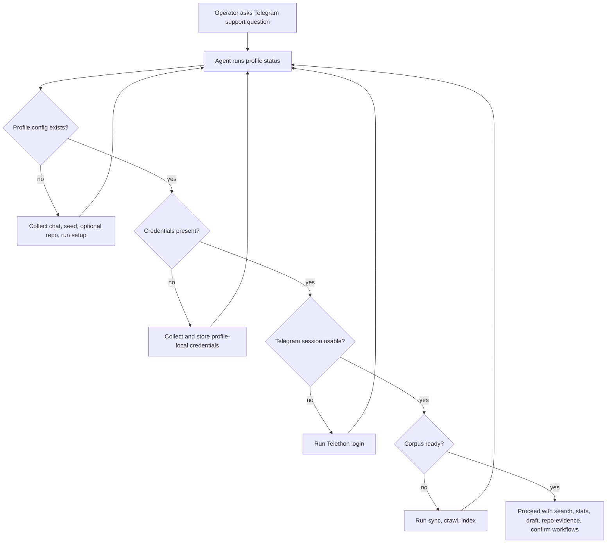

# feat: Add agent-led setup flow

## Summary

Add a first-run setup path that lets the Codex skill detect an unready Support Profile and guide the operator through profile config, optional Repository Evidence config, profile-local Telegram credentials, Telethon login, corpus build, and ready-state verification. The work keeps product behavior in the shared local CLI/core and keeps the Agent Surface as a thin orchestration layer.

---

## Problem Frame

Marketplace installation currently makes the plugin available but does not make a local profile usable. The operator can configure chat and seed data, then hit an unsupported Telegram login error because the Telethon gateway is still a stub and credentials are not modeled as local profile state.

The origin requirements define a Ready Profile as more than a config file: it needs local credentials, a usable Telegram session, synced Telegram history, crawled web pages, and indexes. The plan closes that gap without adding a hosted auth flow, reusing Telegram Desktop sessions, or moving setup behavior into prompt text alone.

---

## Requirements

**Profile state and credentials**

- R1. The local core exposes a machine-readable profile status that distinguishes missing config, missing credentials, missing session, unsynced history, uncrawled seeds, missing/stale index, and ready states.
- R2. Telegram API ID and API hash are stored as sensitive profile-local state outside the repository with owner-only file permissions where the platform supports them.
- R3. Credential setup reports clear validation errors and never prints secret values back in normal command output.
- R4. Setup supports optional GitHub repository and branch configuration for Repository Evidence without making it required for a Ready Profile.

**Telethon access**

- R5. The Telethon gateway uses profile-local credentials and session storage for login, chat resolution, history ingestion, and confirmed reply posting.
- R6. Login cancellation, missing credentials, invalid credentials, and Telegram API errors leave the profile in an actionable non-ready state.
- R7. Chat resolution stores the configured Telegram entity metadata before sync-dependent workflows proceed.

**Agent-led setup**

- R8. The Codex skill checks profile status before analytics, search, draft, or post workflows.
- R9. When a profile is not ready, the skill guides the operator through exactly the missing next step instead of attempting the normal support workflow.
- R10. The guided path runs setup, optional repository configuration, credential configuration, login, sync, crawl, index, and status checks in the order needed to reach a Ready Profile.

**Safety and documentation**

- R11. Existing confirmation-gated posting behavior remains unchanged.
- R12. Setup docs explain how to obtain Telegram API credentials, where profile-local credentials and sessions live, how optional Repository Evidence is configured, and how reset removes local state.
- R13. Tests cover the profile status machine, credential storage behavior, optional repository config behavior, Telethon gateway fakes, and skill workflow instructions.

---

## Key Technical Decisions

- KTD1. **Status command as the setup contract:** Add a CLI status surface that returns readiness facts instead of making the skill infer setup state from failed commands. This keeps the Agent Surface thin while giving Codex a reliable branching point.
- KTD2. **Profile-local credentials file:** Store Telegram API ID and API hash under the Support Profile rather than in shell environment variables. The file should be owner-readable/writeable where supported because profile-local storage is still secret storage.
- KTD3. **Telethon stays behind the gateway protocol:** Implement real Telethon behavior inside the existing gateway boundary while preserving fake gateways for tests. This keeps Telegram integration testable without real network access.
- KTD4. **Corpus readiness is source-backed:** Treat synced messages, crawled pages, chunks, and a current index as separate readiness checks. A saved config or successful login alone is not enough to enter normal workflows.
- KTD5. **Docs and skill text describe the operator path, not hidden automation:** The skill should ask for missing sensitive inputs and show what it is about to run. It should not silently create credentials, infer API secrets, or weaken post confirmation.

---

## High-Level Technical Design

The CLI owns the status facts. The skill owns the operator conversation and calls the next CLI command based on those facts.

---

## Implementation Units

### U1. Profile credential model and status contract

- **Goal:** Add profile-local credential storage and a status command that reports setup readiness in JSON.
- **Requirements:** R1, R2, R3, R13; supports origin R1-R12 and AE1-AE6.
- **Dependencies:** None.
- **Files:** `tg_support/config.py`, `tg_support/cli.py`, `tg_support/storage/db.py`, `tests/test_config.py`, `tests/test_cli_setup.py`, `docs/setup.md`.
- **Approach:** Extend Support Profile handling with a credentials artifact next to `config.json` and `telegram.session`. Add a CLI command that loads config and credentials if present, inspects local database counts/index state, and emits readiness booleans plus a single next action. Keep credential values out of normal JSON output.
- **Patterns to follow:** `profile_dir` and `write_config` already keep profile files under `TG_SUPPORT_HOME` or `~/.tg-support/profiles/<profile>`. `emit` in `tg_support/cli.py` already provides machine-readable output.
- **Test scenarios:**
  - Covers AE1. Given no profile config exists, status returns `ok: false`, reports missing config, and suggests setup.
  - Covers AE2. Given setup ran with `t.me/mailioio`, status reports normalized chat and missing credentials without leaking paths outside the local profile.
  - Covers AE5. Given credentials are absent, login preflight reports missing credentials instead of raising the current generic unsupported gateway error.
  - Given credentials are stored, CLI output redacts the API hash and does not print the raw secret.
  - Given the platform supports POSIX-style file modes, credential storage creates an owner-only credentials file.
- **Verification:** Status output is deterministic enough for the skill to branch without parsing human text.

### U2. Optional repository evidence setup

- **Goal:** Add optional Support Profile configuration for a GitHub repository and branch used by Repository Evidence.
- **Requirements:** R4, R10, R12, R13; supports origin R7-R8 and AE3-AE4.
- **Dependencies:** U1.
- **Files:** `tg_support/config.py`, `tg_support/cli.py`, `tests/test_config.py`, `tests/test_cli_setup.py`, `docs/setup.md`.
- **Approach:** Extend profile setup so repository URL and branch can be stored when provided and omitted when skipped. Treat absence of repository config as normal for readiness; Repository Evidence workflows can later report that repo evidence is not configured.
- **Patterns to follow:** `SupportConfig` already stores profile-specific chat, seeds, paths, and embedding model. Keep repository config in the Support Profile rather than in the plugin source tree.
- **Test scenarios:**
  - Covers AE3. Given setup runs without repository options, status can still report ready after Telegram, crawl, and index checks pass.
  - Covers AE4. Given setup includes a repository and branch, config persists those fields under the local Support Profile.
  - Given invalid repository configuration, setup reports a validation error without writing partial repo state.
  - Given repository config is absent, normal search and draft workflows do not attempt repo lookup by default.
- **Verification:** Optional repository config is visible to later Repository Evidence work but does not participate in Ready Profile gating.

### U3. Real Telethon gateway behind the existing protocol

- **Goal:** Replace the unsupported gateway stub with real credential-backed Telethon login, chat resolution, history ingestion, and reply sending.
- **Requirements:** R5, R6, R7, R11, R13; supports origin R11-R12 and AE6.
- **Dependencies:** U1.
- **Files:** `tg_support/telegram_client.py`, `tg_support/cli.py`, `tg_support/support/posting.py`, `tests/test_telegram_client.py`, `tests/test_posting_confirmation.py`, `docs/setup.md`.
- **Approach:** Load profile-local credentials when constructing `TelethonGateway`, create the client with the profile-local session path, and map Telethon exceptions into `TelegramError` messages that the Agent Surface can act on. Preserve the `TelegramGateway` protocol so existing fake gateway tests stay fast and local.
- **Patterns to follow:** `TelegramService` already isolates login, chat resolution, history ingestion, and reply sending. Posting tests already prove missing gateway failures must not consume confirmation tokens.
- **Test scenarios:**
  - Covers AE6. Given a fake authorized Telethon client, login returns success and status can treat the session as usable.
  - Given invalid credentials, login returns an actionable error and does not mark the profile ready.
  - Given a resolvable chat handle, chat resolution persists a stable Telegram ID, title, and type.
  - Given fake Telegram history, sync stores message IDs, authors, timestamps, text, and reply IDs.
  - Given a valid confirmation token, posting still sends exactly once through the gateway.
- **Verification:** Unit tests cover gateway behavior with fakes; real login remains a manual verification path because it needs Telegram credentials and an operator code prompt.

### U4. Corpus build readiness and status integration

- **Goal:** Make sync, crawl, index, and stale-index state visible through the profile status contract.
- **Requirements:** R1, R6, R7, R10, R13; supports origin R13-R15 and AE7.
- **Dependencies:** U1, U3.
- **Files:** `tg_support/cli.py`, `tg_support/storage/db.py`, `tg_support/indexing/hybrid.py`, `tests/test_cli_setup.py`, `tests/test_storage.py`, `tests/test_hybrid_retrieval.py`.
- **Approach:** Use existing SQLite counts and index run metadata to determine whether Telegram messages, crawled pages, chunks, and current index projections exist. Report partial failures as not-ready states with the next retry action.
- **Patterns to follow:** `HybridRetriever.stale` already detects missing or stale index runs. `SupportDatabase.count` already exposes the tables needed for readiness checks.
- **Test scenarios:**
  - Given a profile with credentials and session but no messages, status suggests sync.
  - Given messages but no crawled pages, status suggests crawl.
  - Given source data but no chunks or stale index metadata, status suggests index.
  - Given messages, pages, chunks, and a current index, status reports ready.
  - Given a crawl error page, status reports corpus not ready unless usable crawled text exists.
- **Verification:** A fixture database can move through not-ready states to ready without a real Telegram or network call.

### U5. Agent-surface setup guidance

- **Goal:** Update the Codex skill so normal workflows are gated by profile status and missing setup steps are guided from inside Codex.
- **Requirements:** R8, R9, R10, R11, R13; supports origin F1-F4 and AE1-AE8.
- **Dependencies:** U1, U2, U3, U4.
- **Files:** `skills/telegram-support/SKILL.md`, `skills/telegram-support/references/reply-workflow.md`, `skills/telegram-support/references/analytics-workflow.md`, `agents/openai.yaml`, `tests/test_cli_setup.py`, `docs/setup.md`.
- **Approach:** Add a preflight rule to the skill: run status first, explain the next missing step, ask for required operator inputs, and run only the next setup command. Normal analytics and reply workflows resume only after status is ready.
- **Patterns to follow:** Existing skill text already requires CLI JSON as the source of truth and keeps posting behind explicit confirmation. Keep that posture for setup state.
- **Test scenarios:**
  - Covers AE1. Skill instructions tell the agent to start setup guidance when status reports missing config.
  - Covers AE3. Skill instructions treat skipped repository configuration as acceptable for core readiness.
  - Covers AE5. Skill instructions tell the agent to explain Telegram credential setup when status reports missing credentials.
  - Covers AE7. Skill instructions order sync, crawl, and index before reporting ready.
  - Covers AE8. Skill instructions preserve the evidence and confirmation path once ready.
- **Verification:** A reader can follow the skill instructions without inventing commands or bypassing the CLI status contract.

### U6. Documentation and reset behavior

- **Goal:** Document first-run setup, optional Repository Evidence config, Telegram API credential acquisition, profile-local sensitive files, and reset behavior.
- **Requirements:** R2, R3, R4, R9, R12; supports origin success criteria and scope boundaries.
- **Dependencies:** U1, U2, U3, U4, U5.
- **Files:** `README.md`, `docs/setup.md`, `CONCEPTS.md`, `tests/test_config.py`.
- **Approach:** Update install/use docs so marketplace users understand that Codex will guide setup, but direct CLI users can still run the same commands. Document that deleting a profile removes config, credentials, Telegram session, SQLite data, and indexes.
- **Patterns to follow:** `README.md` already separates Codex install from direct CLI use. `CONCEPTS.md` already defines Support Profile and Ready Profile.
- **Test scenarios:**
  - Documentation examples use generic chat and seed values rather than Mailio-only hard-coding.
  - Docs state that GitHub repository evidence setup is optional and can be skipped.
  - Docs state that Telegram API hash is secret local state and should not be committed.
  - Reset instructions cover optional repository checkout/config, credentials, session files, SQLite data, and index data.
- **Verification:** A new operator can identify which setup inputs are required, which repository evidence inputs are optional, where Telegram credentials are stored locally, and how to reset the profile.

---

## Scope Boundaries

- Hosted OAuth, cloud authentication, and shared hosted storage remain out of scope.
- Reusing Telegram Desktop or mobile sessions remains out of scope.
- A full interactive CLI wizard is deferred; the primary setup experience is agent-led through Codex.
- Multi-profile discovery and profile switching beyond accepting `--profile` are deferred.
- Secret encryption or OS keychain integration is deferred unless owner-only local file permissions prove insufficient during implementation.
- Repository checkout freshness and code-reading behavior are handled by the Repository Evidence feature; setup only captures optional repo and branch configuration.

---

## System-Wide Impact

This change makes profile readiness a cross-surface contract. Codex, Claude companion docs, and direct CLI use should all rely on the same local status facts rather than maintaining separate setup heuristics.

The work also introduces profile-local credential storage. That widens the local sensitive-state boundary from Telegram session files and support data to include Telegram API credentials.

Optional Repository Evidence configuration widens setup inputs without widening the Ready Profile gate. A profile without a configured GitHub repository can still be ready for normal Telegram, web, search, analytics, draft, and post workflows.

---

## Risks & Dependencies

- **Telegram account risk:** Telegram warns that unofficial API clients are monitored for abuse. The implementation should keep sync behavior bounded by the configured history limit and surface rate-limit or permission errors without retry loops.
- **Secret exposure risk:** API hash values must not appear in normal JSON output, docs examples, tests, or agent transcripts beyond the operator-provided input.
- **TTY/login friction:** Telethon login may require phone, code, or password prompts. The CLI must fail clearly when it cannot interactively complete login.
- **State mismatch risk:** A session file may exist but be invalid. Status should validate authorization rather than relying only on file presence when feasible.
- **Corpus false-ready risk:** A crawl can succeed with no useful text. Ready-state checks should require usable source data and current index metadata.
- **Optional-config confusion:** Operators may think repository evidence is required. Setup copy and status output should label GitHub repo configuration as optional unless the current request specifically needs code evidence.

---

## Acceptance Examples

- AE1. Given no profile exists, when the operator asks for a support answer, then the skill runs status and starts setup guidance instead of attempting search.
- AE2. Given `t.me/mailioio` and `https://mailio.io/blog`, when setup runs, then the stored profile uses a normalized chat and canonical seed under the local profile directory.
- AE3. Given the operator skips repository evidence configuration, when setup otherwise completes, then status can still report a Ready Profile.
- AE4. Given the operator provides a GitHub repository and production branch during setup, when setup completes, then the Support Profile stores that optional configuration.
- AE5. Given missing Telegram credentials, when login is requested, then the CLI reports missing credentials and the skill explains how to provide profile-local API ID and hash.
- AE6. Given valid profile-local credentials and successful Telegram authorization, when login completes, then subsequent status sees a usable session.
- AE7. Given a logged-in profile with no corpus, when setup guidance continues, then sync, crawl, and index run before the skill reports ready.
- AE8. Given a Ready Profile, when the operator asks for a draft reply, then the skill follows the existing evidence and confirmation workflow.

---

## Documentation / Operational Notes

- Update `README.md` to present Codex setup as an agent-led flow after marketplace installation.
- Update `docs/setup.md` with optional Repository Evidence config, Telegram API credential acquisition steps, profile-local storage notes, and reset semantics.
- Keep examples generic and avoid committing real API IDs, API hashes, phone numbers, or session paths.
- Mention that the Telegram API hash is a secret and that Telegram does not provide a casual revoke path for exposed hashes.

---

## Sources & Research

- Origin requirements: `docs/brainstorms/2026-06-25-agent-led-setup-requirements.md`.
- Optional repository evidence requirements: `docs/brainstorms/2026-06-25-github-repo-evidence-requirements.md`.
- Existing architecture learning: `docs/solutions/architecture-patterns/thin-agent-surfaces-shared-local-cli-core.md`.
- Current setup and CLI boundaries: `README.md`, `docs/setup.md`, `tg_support/cli.py`, `tg_support/config.py`, `tg_support/telegram_client.py`.
- Current tests: `tests/test_cli_setup.py`, `tests/test_config.py`, `tests/test_telegram_client.py`, `tests/test_posting_confirmation.py`, `tests/test_hybrid_retrieval.py`.
- Telegram API docs: https://core.telegram.org/api/obtaining_api_id.
- Telethon signing-in docs: https://docs.telethon.dev/en/stable/basic/signing-in.html.
- Telethon client docs: https://docs.telethon.dev/en/stable/modules/client.html.
- Telethon session docs: https://docs.telethon.dev/en/stable/concepts/sessions.html.
