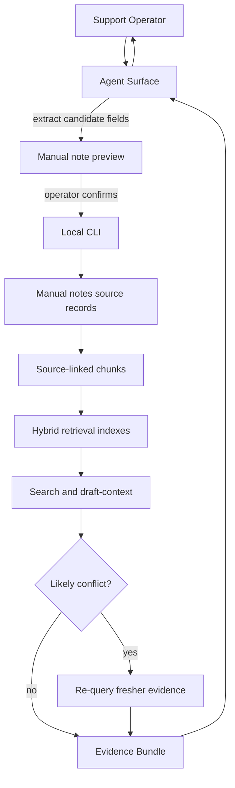

# feat: Add manual knowledge notes

## Summary

Add confirmed Manual Knowledge Notes as a first-class local corpus source. The plan extends the existing SQLite-backed source, chunking, hybrid retrieval, evidence, and Codex workflow boundaries so dated support facts can influence drafts while remaining visible and operator-controlled.

---

## Problem Frame

The current corpus is built from Telegram history and crawled web pages. That works for historical evidence, but it cannot represent newer operational truth that was never posted publicly or that reverses older answers.

The origin requirements define Manual Knowledge Notes as operator-confirmed support facts with effective and optional expiry windows. The implementation needs to persist those notes locally, index them with source traceability, rank active notes above stale sources, and surface conflicts before the agent treats contested knowledge as settled truth.

---

## Requirements

**Manual note persistence**

- R1. The Local Core stores Manual Knowledge Notes as profile-local source records with note text, effective date, optional expiry date, optional caveats, and saved metadata.
- R2. The CLI exposes a JSON-producing save path for confirmed note fields, while Codex owns preview, revision, and cancellation before invoking the write.
- R3. Manual Knowledge Notes remain local to the Support Profile and are not written into the plugin source tree.

**Indexing and retrieval**

- R4. Manual Knowledge Notes are chunked into source-linked records that preserve note metadata in Evidence Bundles.
- R5. Active Manual Knowledge Notes are ranked ahead of older Telegram and web evidence when they apply to a query or draft context.
- R6. Not-yet-effective and expired notes are excluded from current-truth retrieval unless explicitly requested for inspection.
- R7. Search and draft-context responses include Manual Knowledge Notes when they influence an answer.

**Conflict handling**

- R8. Retrieval reports likely conflicts between active notes and older Telegram or web evidence when both appear relevant.
- R9. Conflict handling re-queries fresher indexed corpus evidence before returning a conflict prompt to the Agent Surface.
- R10. The Agent Surface asks the operator how to proceed when conflict results are unresolved.

**Agent workflow and documentation**

- R11. The Codex skill documents natural-language note capture, parsed-field confirmation, and conflict resolution behavior.
- R12. Reply and analytics workflows show Manual Knowledge Notes in evidence summaries when notes influenced the result.

---

## Key Technical Decisions

- **KTD1. Model notes as a new corpus source:** Manual Knowledge Notes should join the same source-linked chunk/index path as Telegram and web records. This keeps Evidence Bundles uniform and avoids a separate knowledge-base subsystem.
- **KTD2. Use a confirmed-field save path:** Codex may extract and preview fields from natural language, but the CLI should persist only fields the operator has confirmed. This mirrors the existing safety split where agent judgment proposes and deterministic local code records the canonical state.
- **KTD3. Treat validity windows as retrieval filters:** Effective and expiry dates belong in note metadata and retrieval eligibility, not only in agent instructions. This prevents expired policy notes from silently steering drafts.
- **KTD4. Prefer heuristic conflict surfacing over semantic certainty:** The first version should detect likely conflict by retrieving relevant older and fresher corpus evidence around an active note. It should ask the operator rather than pretending to prove contradiction.
- **KTD5. Preserve thin Agent Surfaces:** The Codex and companion docs should explain when to call the CLI and how to present results, while parsing persistence, indexing, and conflict metadata stay in the Local Core.

---

## High-Level Technical Design

Manual Knowledge Notes enter the corpus through a confirmed local write, then follow the same indexing and evidence path as existing sources. Conflict handling is part of retrieval output, not a separate agent-only judgment step.

---

## Implementation Units

### U1. Manual note storage model

- **Goal:** Add durable Manual Knowledge Note records and allow chunks to reference them as source records.
- **Requirements:** R1, R3, R4
- **Dependencies:** None
- **Files:** `tg_support/storage/schema.py`, `tg_support/storage/db.py`, `tests/test_storage.py`
- **Approach:** Extend the schema with manual note source records and update chunk source typing so note chunks can trace back to saved notes. Add database helpers for creating, reading, and listing notes with parsed validity fields and metadata.
- **Patterns to follow:** Existing `pages`, `messages`, `chunks`, and `SupportDatabase.upsert_*` helpers show the local SQLite source-record pattern.
- **Test scenarios:**
  - Creating a note persists text, effective date, optional expiry date, caveats, and created metadata.
  - Creating a note does not require Telegram or web data to exist.
  - A chunk for a manual note traces back to the note source and preserves note metadata.
  - Reinitializing the database remains idempotent after the schema extension.
- **Verification:** Storage tests prove notes are durable local source records and can participate in chunk source traceability.

### U2. Confirmed note capture CLI

- **Goal:** Expose a machine-readable CLI path for saving Manual Knowledge Notes after operator confirmation.
- **Requirements:** R1, R2, R3, R11
- **Dependencies:** U1
- **Files:** `tg_support/cli.py`, `tg_support/support/knowledge.py`, `tests/test_cli_setup.py`, `tests/test_manual_knowledge.py`
- **Approach:** Add a support-layer module for manual knowledge operations and a CLI command that accepts confirmed note fields. The Agent Surface extracts natural-language fields, shows the operator the candidate fields, handles revision or cancellation in conversation, then calls the save command only after approval.
- **Execution note:** Implement the save behavior test-first because it is a new write path into the local corpus.
- **Patterns to follow:** `command_credentials`, `command_draft_create`, and `create_draft` show JSON command output, profile-local writes, and confirmation-adjacent behavior.
- **Test scenarios:**
  - Given complete parsed fields, saving a confirmed note returns JSON with note ID and validity fields.
  - Given missing note text or invalid date fields, the CLI returns actionable JSON failure without writing a note.
  - Given a cancellation path, no note is persisted.
  - Given a custom profile, the note is written to that profile's local database.
- **Verification:** CLI tests prove note writes are explicit, JSON-backed, and profile-local.

### U3. Manual note chunking and indexing

- **Goal:** Include Manual Knowledge Notes in rebuildable chunks and hybrid retrieval indexes.
- **Requirements:** R4, R5, R6, R7
- **Dependencies:** U1, U2
- **Files:** `tg_support/indexing/chunking.py`, `tg_support/indexing/hybrid.py`, `tg_support/storage/db.py`, `tests/test_chunking.py`, `tests/test_hybrid_retrieval.py`, `tests/test_manual_knowledge.py`
- **Approach:** Add note chunking alongside page and message chunking, with metadata carrying validity and source details. Update indexing to include note chunks and make active note results eligible for priority boosting while filtering inactive notes for normal searches.
- **Patterns to follow:** `chunk_pages`, `chunk_messages`, `HybridRetriever.build`, and `HybridRetriever.search` already return source-linked chunk metadata.
- **Test scenarios:**
  - Active notes are chunked and returned with `source_type` identifying manual knowledge.
  - Expired notes are not returned for normal current-truth search.
  - Not-yet-effective notes are not returned for normal current-truth search.
  - An active note relevant to a query ranks above older Telegram or web evidence.
  - Rebuilding the index includes note chunks without deleting source records.
- **Verification:** Retrieval tests prove note evidence is source-linked, validity-filtered, and ranked ahead of stale sources.

### U4. Conflict-aware retrieval output

- **Goal:** Report likely conflicts and fresher-evidence re-query results when active notes and other corpus sources disagree or compete.
- **Requirements:** R8, R9, R10, R12
- **Dependencies:** U3
- **Files:** `tg_support/indexing/hybrid.py`, `tg_support/support/context.py`, `tests/test_hybrid_retrieval.py`, `tests/test_manual_knowledge.py`
- **Approach:** Extend retrieval results with conflict metadata when an active note overlaps with older Telegram or web evidence. Use a second targeted search over newer corpus items when conflict candidates are detected, then return a structured conflict block for the Agent Surface to present.
- **Patterns to follow:** `draft_context` already packages `history`, `thread`, `evidence`, and `suggestion`; conflict output should be another machine-readable field rather than prose-only behavior.
- **Test scenarios:**
  - Given an active note and older web evidence about the same policy, draft context includes a conflict block.
  - Given newer Telegram evidence that agrees with the note, the conflict block includes the newer evidence for operator review.
  - Given no relevant older evidence, retrieval returns the note without a conflict block.
  - Given unresolved conflict metadata, draft context does not hide the conflict from the caller.
- **Verification:** Context tests prove likely conflicts are visible to agents and include note and corpus evidence needed for operator resolution.

### U5. Search and draft workflow integration

- **Goal:** Make Manual Knowledge Notes visible in normal support answers and drafts without weakening posting confirmation.
- **Requirements:** R7, R10, R11, R12
- **Dependencies:** U3, U4
- **Files:** `tg_support/cli.py`, `tg_support/support/context.py`, `skills/telegram-support/SKILL.md`, `skills/telegram-support/references/reply-workflow.md`, `skills/telegram-support/references/analytics-workflow.md`, `agents/openai.yaml`, `agents/claude.md`, `tests/test_cli_setup.py`, `tests/test_manual_knowledge.py`
- **Approach:** Update `search` and `draft-context` JSON outputs so note evidence and conflict blocks are available to agent surfaces. Update Codex and companion guidance to require parsed-field confirmation before saving and operator resolution before using contested note evidence.
- **Patterns to follow:** Existing reply workflow requires evidence display and confirmation tokens before Telegram writes; manual note workflows should use the same operator-visible safety posture without reusing Telegram post tokens.
- **Test scenarios:**
  - Search returns manual note evidence with note metadata when a note matches the query.
  - Draft context includes manual note evidence alongside target history and thread context.
  - Reply workflow docs tell the agent to show manual note evidence before drafting from it.
  - Skill docs instruct Codex to request confirmation before saving a natural-language note.
  - Existing posting confirmation tests still pass without behavior changes.
- **Verification:** CLI and docs tests prove agent surfaces can see note evidence and that Telegram posting remains separately confirmation-gated.

### U6. Documentation and operator examples

- **Goal:** Document how operators save dated manual knowledge and how that knowledge appears during support workflows.
- **Requirements:** R11, R12
- **Dependencies:** U2, U5
- **Files:** `README.md`, `docs/setup.md`, `CONCEPTS.md`, `tests/test_cli_setup.py`
- **Approach:** Add concise examples for saving an account-transfer policy note, explaining effective/expiry behavior, and interpreting note evidence or conflicts. Keep the docs local-first and avoid presenting manual notes as a hosted knowledge base.
- **Patterns to follow:** README and setup docs currently show command-oriented examples followed by agent-facing prompts.
- **Test scenarios:**
  - Documentation examples mention natural-language Codex save flow and confirmed local persistence.
  - Documentation explains that active manual notes can supersede older evidence but conflicts require operator review.
  - Glossary entries for Manual Knowledge Note and Conflict Check remain consistent with the implemented behavior.
- **Verification:** Documentation gives an operator enough information to save and recognize manual note evidence without discovering CLI internals first.

---

## Scope Boundaries

### In Scope

- New local source records for confirmed Manual Knowledge Notes.
- Note chunking, indexing, search, draft-context evidence, and validity filtering.
- Heuristic conflict metadata with fresher-evidence re-query.
- Codex skill guidance for natural-language capture, confirmation, and conflict resolution.

### Deferred to Follow-Up Work

- Periodic stale-note audits and review queues.
- Bulk import or export of manual knowledge.
- Multi-operator ownership, approvals, or collaborative editing.
- Strong semantic contradiction detection beyond retrieval-backed heuristics.

### Outside This Product's Identity

- Silent corpus mutation from casual conversation.
- Silent conflict resolution by the agent.
- Hosted knowledge-base management.

---

## System-Wide Impact

Manual Knowledge Notes add a third retrievable corpus source and a new local write path. The implementation must keep source traceability, profile-local storage, and agent-visible evidence intact so support drafts remain auditable.

This feature also changes the meaning of evidence priority: active manual notes can outrank older sources because they may represent a newer operational policy. That priority must be paired with conflict visibility so the agent does not hide contested support truth from the operator.

---

## Risks & Dependencies

- **Schema evolution risk:** The current schema uses a fixed schema version without a migration framework. The implementation must update initialization and tests carefully so existing profiles can be handled intentionally.
- **Overconfident conflict detection:** Retrieval overlap is not semantic proof. The plan mitigates this by surfacing likely conflicts and asking the operator.
- **Agent prompt drift:** Natural-language save behavior could diverge across surfaces if encoded only in prose. The plan keeps persistence and retrieval behavior in the Local Core.
- **Evidence ranking regressions:** Boosting notes could bury useful context. Tests should cover both priority and evidence bundle completeness.

---

## Acceptance Examples

- AE1. **Covers R1, R2, R3.** Given Codex extracts a note that account transfer was discontinued effective April 2, 2026, when the operator confirms the parsed fields, then the Local Core saves a profile-local Manual Knowledge Note.
- AE2. **Covers R4, R5, R6, R7.** Given an active Manual Knowledge Note matches a draft request, when `draft-context` runs, then note evidence appears in the returned evidence and is ranked ahead of older conflicting sources.
- AE3. **Covers R6.** Given a note is expired, when a normal support search runs after the expiry date, then the note does not influence current-truth retrieval.
- AE4. **Covers R8, R9, R10.** Given an active note conflicts with older web evidence, when the agent prepares context, then the result includes conflict metadata and fresher evidence for operator review.
- AE5. **Covers R11, R12.** Given a conflict block is returned, when Codex drafts a reply, then it asks the operator how to resolve the conflict before treating the note as settled truth.

---

## Documentation / Operational Notes

- Update operator docs with one natural-language capture example and one direct CLI-oriented example if a direct command is exposed for debugging or automation.
- Document that Manual Knowledge Notes are local profile data and should be treated with the same sensitivity as Telegram history and crawled support resources.
- Document that conflict checks are heuristic and operator-confirmed, not a guarantee of semantic contradiction detection.

---

## Sources / Research

- `docs/brainstorms/2026-06-25-manual-knowledge-notes-requirements.md` is the origin requirements document.
- `CONCEPTS.md` defines the canonical vocabulary for Support Operator, Agent Surface, Local Core, Support Profile, Evidence Bundle, Manual Knowledge Note, and Conflict Check.
- `tg_support/storage/schema.py` currently defines Telegram, web, chunk, index, draft, confirmation, and post-attempt tables.
- `tg_support/storage/db.py` provides the SQLite helper boundary used by ingestion, indexing, and posting.
- `tg_support/indexing/chunking.py` and `tg_support/indexing/hybrid.py` provide the source-linked retrieval path to extend.
- `tg_support/support/context.py` packages draft-context evidence for Agent Surfaces.
- `skills/telegram-support/SKILL.md` and `skills/telegram-support/references/reply-workflow.md` define the agent-facing safety workflow.
- `docs/solutions/architecture-patterns/thin-agent-surfaces-shared-local-cli-core.md` captures the durable architecture pattern for this plugin.
