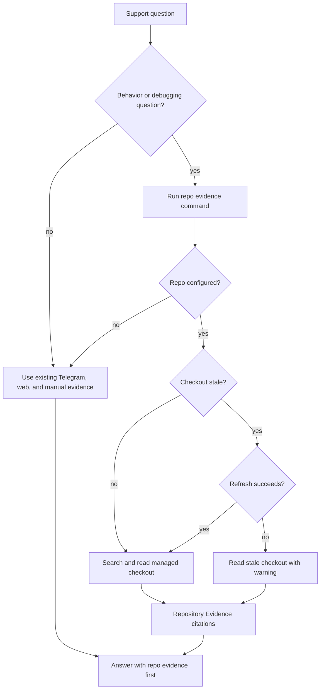

# feat: Add GitHub repo evidence

## Summary

Add read-only Repository Evidence for product-behavior and debugging support questions. The Local Core will store optional GitHub repository configuration in the Support Profile, manage a profile-local checkout, check freshness before use, and return code citations that Agent Surfaces can rank above Manual Knowledge Notes, Telegram evidence, and web evidence.

---

## Problem Frame

Support answers can depend on current production-branch behavior rather than remembered behavior or public documentation. The existing corpus handles Telegram history, crawled web pages, and Manual Knowledge Notes, but code changes too often to fit the indexed chunk model safely.

The plan extends the established local CLI/core pattern instead of putting repository logic into prompt instructions. Repository setup remains optional so a Ready Profile for normal Telegram and web support is not blocked when code evidence is not configured.

---

## Requirements

**Repository Configuration**

- R1. A Support Profile can store an optional GitHub repository and branch for Repository Evidence.
- R2. Repository setup uses the operator's existing local `gh` or `git` authentication and never asks for GitHub credentials.
- R3. Repository checkout state stays profile-local and separate from the plugin source repository.
- R4. Repository Evidence operations are read-only from the support workflow.

**Freshness and Evidence Collection**

- R5. The Local Core checks the managed checkout against the configured branch before returning Repository Evidence.
- R6. A stale checkout refreshes before file reads when refresh succeeds.
- R7. Refresh failure returns a stale-evidence warning instead of silently hiding staleness.
- R8. Repository content is gathered through targeted live search and file reads rather than stored in the hybrid index.

**Agent Workflow and Priority**

- R9. Agent Surfaces request Repository Evidence only for product-behavior, capability, API-behavior, or debugging questions.
- R10. Repository Evidence outranks Manual Knowledge Notes, Telegram evidence, and web evidence when sources disagree.
- R11. Code-grounded answers include precise source references and explain behavior in support language.
- R12. The support workflow continues from lower-priority evidence when Repository Evidence is absent, irrelevant, or insufficient.
- R13. The workflow does not create Manual Knowledge Notes, modify code, create branches, or open pull requests from Repository Evidence findings.

---

## Key Technical Decisions

- KTD1. **Profile config owns repo identity:** Store repository URL and branch on `SupportConfig` so setup, status, and repo-evidence commands share one profile-local source of truth.
- KTD2. **Managed checkout over indexed chunks:** Keep code outside `chunks`, `lexical_refs`, and `vector_refs` because branch-specific code freshness matters more than semantic index reuse.
- KTD3. **CLI JSON is the evidence contract:** Add a Local Core command that returns freshness, warning, and citation objects so Agent Surfaces summarize evidence without owning checkout logic.
- KTD4. **Git first, gh-compatible by auth:** Use normal Git operations for clone, fetch, checkout, and rev comparison so existing `gh` authentication helpers can satisfy private repository access without a separate credential path.
- KTD5. **Agent Surface detects code relevance:** Keep the product judgment about when to ask for repo evidence in the skill text, while the Local Core owns whether repo evidence is configured, fresh, stale, or unavailable.

---

## High-Level Technical Design

Repository Evidence is a live source that sits beside the indexed corpus. The command boundary returns evidence and warnings; the Agent Surface decides when to invoke it and how to present it.

---

## Implementation Units

### U1. Repository config in Support Profile

- **Goal:** Add optional repository URL and branch fields to profile configuration.
- **Requirements:** R1, R2, R3; supports origin F1 and AE1.
- **Dependencies:** None.
- **Files:** `tg_support/config.py`, `tg_support/cli.py`, `tests/test_config.py`, `tests/test_cli_setup.py`.
- **Approach:** Add a small repository config value to `SupportConfig`, validate repository identifiers as URLs or common GitHub owner/repo forms, and persist it only when supplied. Extend setup arguments and status output to expose repository configuration without making it required for a Ready Profile.
- **Patterns to follow:** `SeedConfig`, `config_from_dict`, `write_config`, and setup tests already show how optional profile fields should validate and round-trip through local JSON.
- **Test scenarios:**
  - Covers AE1. Given setup includes a repository and production branch, config stores those values under the local profile.
  - Given setup omits repository options, config loads successfully and status can still proceed through normal readiness checks.
  - Given repository config is present, status reports it as configured without changing `next_action`.
  - Given an invalid repository value, setup returns JSON with `ok: false` and does not write partial repo config.
  - Given a GitHub owner/repo shorthand, config normalizes it to a cloneable repository identity.
- **Verification:** Profile config round-trips repository settings and preserves current setup behavior when no repository is provided.

### U2. Managed checkout service

- **Goal:** Create Local Core behavior for clone/fetch, stale checks, refresh, and read-only checkout paths.
- **Requirements:** R2, R3, R4, R5, R6, R7; supports origin F1-F3 and AE1-AE3.
- **Dependencies:** U1.
- **Files:** `tg_support/repository.py`, `tg_support/config.py`, `tests/test_repository.py`, `tests/test_cli_setup.py`.
- **Approach:** Add a repository service that resolves a deterministic profile-local checkout directory, compares local and remote branch revisions, refreshes stale checkouts, and reports structured freshness state. The service should run Git commands without embedding credentials and should reject operations that would modify the upstream repository.
- **Patterns to follow:** `profile_dir`, `ensure_private_directory`, and Telegram credential paths show how to keep local state under the Support Profile. CLI functions already convert Local Core errors into JSON instead of traceback text.
- **Test scenarios:**
  - Covers AE2. Given a stale checkout and a successful refresh, the service reports fresh evidence state before reads.
  - Covers AE3. Given a stale checkout and failed refresh, the service reports a stale warning and leaves the checkout readable.
  - Given no local checkout exists, the service creates one under the Support Profile rather than the plugin source tree.
  - Given Git is unavailable or returns a permission error, the service returns an actionable unavailable state without asking for credentials.
  - Given a configured branch, the checkout stays on that branch and does not create new branches.
- **Verification:** Tests use temporary local Git repositories or faked command runners to prove freshness, refresh, and failure states without network access.

### U3. Repository evidence command

- **Goal:** Expose targeted Repository Evidence lookup through the CLI as machine-readable JSON.
- **Requirements:** R5, R6, R7, R8, R10, R11, R12; supports origin F2-F3 and AE2-AE4.
- **Dependencies:** U1, U2.
- **Files:** `tg_support/cli.py`, `tg_support/repository.py`, `tg_support/support/repository_evidence.py`, `tests/test_repository_evidence.py`, `tests/test_cli_setup.py`.
- **Approach:** Add a command that accepts a support query, checks repo configuration and checkout freshness, performs targeted lexical search across text-like source files, and returns citation records with repo, branch, revision, path, line range, excerpt, and freshness warning when present. Keep the command separate from `search` and `draft-context` so live code lookup does not alter indexed corpus behavior.
- **Patterns to follow:** `command_search`, `command_draft_context`, and `emit` show the current JSON command contract. `HybridRetriever.search_with_conflicts` is the model for returning evidence plus warnings or conflicts without prose-only behavior.
- **Test scenarios:**
  - Covers AE2. Given a code-relevant query and fresh checkout, the command returns matching code evidence with path and revision metadata.
  - Covers AE3. Given refresh fails, the command returns `ok: true` with stale warning metadata and evidence from the last checkout when possible.
  - Covers AE4. Given repository evidence and lower-priority evidence disagree, the repo evidence payload carries enough metadata for the Agent Surface to show code precedence.
  - Given repository config is absent, the command returns an unavailable state that lets the support workflow continue with other evidence.
  - Given binary, generated, or hidden files are present, search skips them or marks them unsupported rather than emitting unreadable excerpts.
- **Verification:** CLI tests assert JSON shape, stale warning behavior, and source references without requiring GitHub network access.

### U4. Agent-surface workflow integration

- **Goal:** Teach Codex and companion surfaces when and how to request Repository Evidence.
- **Requirements:** R9, R10, R11, R12, R13; supports origin F2-F3 and AE2-AE5.
- **Dependencies:** U3.
- **Files:** `skills/telegram-support/SKILL.md`, `skills/telegram-support/references/reply-workflow.md`, `skills/telegram-support/references/analytics-workflow.md`, `agents/openai.yaml`, `agents/claude.md`, `tests/test_cli_setup.py`.
- **Approach:** Add a repository-evidence workflow rule: after normal status readiness, request repo evidence only for behavior, capability, API, or debugging questions. The skill should show stale warnings, cite repository evidence ahead of Manual Knowledge Notes and indexed sources, and avoid converting code findings into Manual Knowledge Notes unless the operator starts a separate confirmed note workflow.
- **Patterns to follow:** Existing Manual Knowledge Note conflict instructions already require the agent to surface source priority and operator-visible conflicts. Existing posting instructions keep agent reasoning separate from external writes.
- **Test scenarios:**
  - Covers AE2. Skill text tells the agent to check Repository Evidence for product-behavior questions.
  - Covers AE3. Skill text requires stale checkout warnings to be shown when returned.
  - Covers AE4. Skill text states that configured-branch code outranks Manual Knowledge Notes, Telegram evidence, and web evidence.
  - Covers AE5. Skill text forbids writing Manual Knowledge Notes or modifying code from repo evidence findings.
  - Given a normal analytics or drafting question with no behavior/debugging signal, skill text keeps the normal corpus workflow.
- **Verification:** Instruction tests assert the new command, source-priority rule, stale-warning rule, and write-safety boundary are documented in agent surfaces.

### U5. Optional setup and documentation polish

- **Goal:** Align setup docs and direct CLI usage with optional Repository Evidence configuration.
- **Requirements:** R1, R2, R3, R12; supports origin F1 and success criteria.
- **Dependencies:** U1, U3, U4.
- **Files:** `README.md`, `docs/setup.md`, `tests/test_cli_setup.py`.
- **Approach:** Document repository configuration as an optional setup input, explain that readiness does not require it, and describe how stale checkout warnings should be interpreted. Keep the existing agent-led setup plan as the source for core readiness and link Repository Evidence as a follow-on capability.
- **Patterns to follow:** `docs/setup.md` already separates Configure, Credentials, Indexing Flow, Manual Knowledge, and Reset. Add repository evidence in the same operator-facing style.
- **Test scenarios:**
  - Documentation states GitHub repo setup is optional and can be skipped.
  - Documentation states existing `gh` or `git` auth is used and no GitHub credential is pasted into the support workflow.
  - Reset documentation includes repository checkout state alongside other local profile artifacts.
  - CLI setup examples remain generic and do not hard-code a private repository.
- **Verification:** A new operator can tell which inputs are required for normal readiness and which inputs enable code-grounded behavior/debugging answers.

---

## Scope Boundaries

### In Scope

- Optional repository and branch configuration on the Support Profile.
- Profile-local managed checkout state.
- Stale checks and refresh before code evidence is used.
- Stale warnings when refresh fails.
- Targeted live code search and source citations.
- Agent-surface instructions for when Repository Evidence should outrank other sources.

### Deferred to Follow-Up Work

- Indexing repository contents into the normal retrieval store.
- Multi-repository precedence rules.
- Release-diff or repository change-summary workflows.
- Automatic Manual Knowledge Note suggestions from code findings.

### Outside This Product's Identity

- Asking the operator to paste GitHub credentials into the support workflow.
- Modifying product code, opening pull requests, or creating branches from support answers.
- Treating public docs, Telegram history, or Manual Knowledge Notes as higher authority than configured production-branch code for behavior questions.

---

## System-Wide Impact

Repository Evidence adds a second evidence path beside the indexed corpus. The indexed corpus remains the source for Telegram, web, and Manual Knowledge Notes; repo evidence is live, branch-specific, and invoked only when the Agent Surface detects a behavior or debugging question.

The Support Profile local-state boundary expands to include repository config and checkout state. Reset and setup documentation must treat that state as local operator data, but not as sensitive credential storage.

---

## Risks & Dependencies

- **Git availability:** The feature depends on local `git`, with `gh` authentication helpers available when private GitHub access requires them.
- **Network and auth failures:** Refresh can fail due to network, remote permissions, or expired local auth. The command must preserve stale-warning semantics and avoid pretending evidence is fresh.
- **Search precision:** A simple live search may miss behavior hidden behind indirection. The Agent Surface should present code evidence as source-backed support context, not as a full static-analysis proof.
- **Prompt overreach:** Agent Surfaces may be tempted to run repo lookup for every question. Instructions and tests should keep lookup conditional.
- **Checkout safety:** Managed checkout code must avoid writing into the plugin source tree or modifying the upstream repository.

---

## Acceptance Examples

- AE1. Given the operator configures a GitHub repo and production branch, when repository evidence setup runs, then the checkout is profile-local, read-only to the support workflow, and uses existing local GitHub authentication.
- AE2. Given a product-behavior question is asked and the checkout is stale, when refresh succeeds, then the answer uses refreshed branch evidence with code references.
- AE3. Given a product-behavior question is asked and refresh fails, when the Agent Surface answers from the stale checkout, then it warns that Repository Evidence may be outdated.
- AE4. Given production-branch code disagrees with a Manual Knowledge Note or public documentation, when the Agent Surface answers a behavior question, then it treats the code as the higher-priority source and shows that precedence.
- AE5. Given code reading reveals support-relevant behavior, when the support workflow completes, then it does not write a Manual Knowledge Note or modify the repository without a separate explicit workflow.

---

## Documentation / Operational Notes

- Update operator docs to describe optional repo setup, the configured branch, local checkout state, and stale warning behavior.
- Update agent instructions to mention Repository Evidence in setup preflight and reply/analytics workflows only where behavior or debugging questions make it relevant.
- Keep setup examples generic and avoid embedding private repository URLs.
- Note that GitHub access relies on the operator's existing local Git configuration or `gh` authentication.

---

## Sources & Research

- Origin requirements: `docs/brainstorms/2026-06-25-github-repo-evidence-requirements.md`.
- Related setup plan: `docs/plans/2026-06-25-002-feat-agent-led-setup-plan.md`.
- Architecture learning: `docs/solutions/architecture-patterns/thin-agent-surfaces-shared-local-cli-core.md`.
- Profile configuration and status patterns: `tg_support/config.py`, `tg_support/cli.py`, `tests/test_config.py`, `tests/test_cli_setup.py`.
- Current evidence and retrieval patterns: `tg_support/support/context.py`, `tg_support/indexing/hybrid.py`, `tests/test_hybrid_retrieval.py`.
- Agent surface patterns: `skills/telegram-support/SKILL.md`, `skills/telegram-support/references/reply-workflow.md`, `agents/openai.yaml`.
