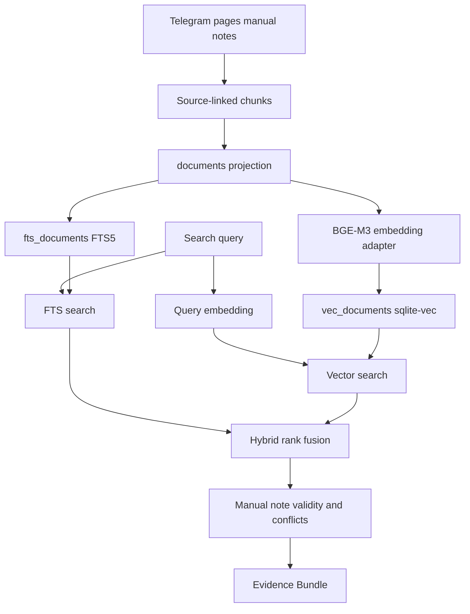

# feat: Replace prototype retrieval with SQLite hybrid search

## Summary

Replace the prototype hash/vector and token-overlap retrieval path with the SQLite Hybrid Search Index. The implementation keeps source-linked Evidence Bundles and Manual Knowledge Note behavior while adding FTS5 exact-term recovery, sqlite-vec vector retrieval, and local `BAAI/bge-m3` embeddings.

---

## Problem Frame

The Local Core already stores Telegram messages, crawled pages, Manual Knowledge Notes, and chunks in profile-local SQLite. Retrieval is still a prototype: lexical scoring happens in Python, dense vectors are hash-derived, and persisted projection rows are JSON blobs that cannot serve real BM25 or vector queries.

The first quality target is exact product and policy term recovery. The new index must make those terms recoverable through normal search without breaking the local-first profile boundary or the source references that Agent Surfaces cite.

---

## Requirements

**Index Shape**

- R1. The Local Core builds a `documents` projection for indexed chunks with source type, source ID, ordinal, text, metadata, and source freshness fields.
- R2. The Local Core builds an FTS5 projection for BM25-style exact-term retrieval over indexed document text.
- R3. The Local Core builds a sqlite-vec projection for local vector retrieval over `BAAI/bge-m3` dense embeddings.
- R4. Index run metadata records the embedding model, index version, source maximum chunk ID, and status needed for staleness checks.
- R5. The new projections may replace the current `lexical_refs` and `vector_refs` projections without backwards-compatible index migration.

**Retrieval Behavior**

- R6. Search combines FTS and sqlite-vec candidates with reciprocal rank fusion or an equivalent stable hybrid ranker.
- R7. Exact product and policy terms present in indexed text are recoverable through the FTS path.
- R8. Search results preserve Evidence Bundle fields: chunk/document ID, source type, source ID, score, text, and metadata.
- R9. Manual Knowledge Note validity filtering, priority behavior, and conflict checks keep their current operator-visible behavior.
- R10. Repository Evidence remains live and branch-aware rather than joining the stored document index.

**Local Operations**

- R11. The default embedding model is `BAAI/bge-m3`.
- R12. Missing embedding/vector dependencies produce actionable CLI errors instead of silent hash-vector fallback.
- R13. Index rebuilds never delete source records for chats, users, messages, pages, Manual Knowledge Notes, drafts, confirmations, or post attempts.
- R14. The core suite stays fast and local by using fakes at embedding and sqlite-vec adapter boundaries.

---

## Key Technical Decisions

- KTD1. **SQLite remains the retrieval authority boundary.** FTS and vector indexes live in the same profile-local database as source metadata, matching the local-first architecture and avoiding a separate vector service.
- KTD2. **Use adapter boundaries for optional runtime dependencies.** Wrap `BAAI/bge-m3` loading and sqlite-vec extension loading behind small adapters so tests can use fakes and CLI commands can report missing local capabilities cleanly.
- KTD3. **Plan for BGE-M3's 1024-dimensional dense vectors.** The sqlite-vec table should be dimensioned for the committed model, with model identity stored in index metadata so a future model change forces rebuild instead of mixing incompatible vectors.
- KTD4. **Prefer FTS tokenizer preservation over stemming.** Product and policy terms often include hyphens, underscores, acronyms, or exact labels, so tokenization should preserve those characters where useful instead of optimizing first for broad stemming.
- KTD5. **Keep FTS and vector scores source-specific before fusion.** FTS `bm25()` and vector distance have different score direction and scale, so ranking should normalize by rank positions rather than raw score arithmetic.
- KTD6. **Treat sqlite-vec as a pre-v1 dependency risk.** Its docs label the API pre-v1, so the implementation should isolate SQL shapes and extension loading in one module.

---

## High-Level Technical Design

Source tables remain authoritative. The `documents`, `fts_documents`, and `vec_documents` projections are rebuildable from chunks and index metadata.

---

## Scope Boundaries

### In Scope

- Replacing normal indexed retrieval with SQLite FTS5 plus sqlite-vec.
- Setting `BAAI/bge-m3` as the configured default embedding model.
- Preserving CLI search, draft-context, status readiness, Manual Knowledge Note, and conflict behavior.
- Adding focused docs for local dependency requirements and index rebuild behavior.

### Deferred to Follow-Up Work

- Multilingual tuning beyond the chosen model's default behavior.
- Query expansion, synonym dictionaries, reranking, learning-to-rank, and relevance feedback.
- Search analytics dashboards.

### Outside This Product's Identity

- Hosted retrieval services for the first product version.
- Storing Repository Evidence in the indexed support corpus.
- Backwards compatibility with pre-product prototype index rows.

---

## Risks & Dependencies

- **sqlite-vec extension loading:** Some local Python/SQLite builds do not allow loadable extensions. Mitigate with startup checks, structured CLI errors, and adapter-isolated extension loading.
- **SQLite version drift:** sqlite-vec documentation recommends modern SQLite versions for some behavior. Mitigate by including the active `sqlite3.sqlite_version` in vector-loading diagnostics.
- **Model runtime cost:** `BAAI/bge-m3` is heavier than the current hash fallback. Mitigate with optional dependencies, fake adapters in tests, and no model download in the core suite.
- **FTS query escaping:** User queries may contain punctuation that matters for product names but has FTS query syntax meaning. Mitigate with a dedicated query-construction helper and tests for punctuation-heavy product terms.
- **Score direction mismatch:** FTS BM25 and vector distance have different score direction and scale. Mitigate by fusing rank positions rather than raw scores.

---

## System-Wide Impact

- **Profile-local data lifecycle:** Existing source tables remain durable, but retrieval projections become more substantial local state. Rebuild behavior must stay repeatable and safe because the profile directory contains sensitive support history.
- **CLI readiness:** Status readiness still depends on chunks plus a current successful index run. Missing embedding or vector capabilities should make the profile not ready with an actionable next step.
- **Agent Surfaces:** Codex and Claude should not gain separate retrieval logic. They continue to consume CLI JSON from search and draft-context commands.
- **Test posture:** The fast suite must keep using fakes at adapter boundaries. Real model loading and sqlite-vec extension behavior belong behind optional or narrowly scoped integration checks.

---

## Implementation Units

### U1. Runtime configuration and dependency posture

- **Goal:** Make the SQLite Hybrid Search Index the configured retrieval posture while keeping heavy dependencies explicit and optional.
- **Requirements:** R11, R12, R14
- **Dependencies:** None
- **Files:** `pyproject.toml`, `tg_support/config.py`, `scripts/tg-support`, `tests/test_config.py`, `tests/test_cli_setup.py`, `docs/setup.md`, `README.md`
- **Approach:** Add optional extras for embedding/vector runtime packages and update the helper-managed runtime to install the retrieval extra for normal operator use. Change defaults from `local-hash-v1` and fallback vector mode to the committed SQLite/BGE-M3 posture.
- **Patterns to follow:** `telegram` and `render` extras keep optional integrations out of the fast core install; setup config already persists profile-local model settings.
- **Test scenarios:**
  - Setup without an explicit embedding model persists `BAAI/bge-m3`.
  - Config round-trip preserves embedding model and vector mode.
  - The helper-managed runtime includes retrieval dependencies for operator indexing.
  - Documentation describes dependency installation and missing-dependency behavior without requiring real Telegram or Playwright.
- **Verification:** A fresh profile reports the committed embedding model in config and docs show the index dependency path.

### U2. SQLite schema and database projection helpers

- **Goal:** Add document and FTS projections plus database helper contracts for vector projections while preserving source tables.
- **Requirements:** R1, R2, R3, R4, R5, R13
- **Dependencies:** U1
- **Files:** `tg_support/storage/schema.py`, `tg_support/storage/db.py`, `tests/test_storage.py`
- **Approach:** Bump the schema version and add rebuildable projection tables for documents and FTS. Keep durable source records in their current tables, replace the JSON projection helpers with document/index helper methods, and leave vector table creation behind the sqlite-vec adapter from U3.
- **Execution note:** Add storage characterization tests before deleting or bypassing existing projection helpers.
- **Patterns to follow:** Existing `chunks`, `index_runs`, and source-record tests prove source traceability and rebuild safety.
- **Test scenarios:**
  - Database initialization creates the new document and FTS projections idempotently.
  - Rebuilding projections does not delete messages, pages, Manual Knowledge Notes, drafts, confirmations, or post attempts.
  - Existing prototype `lexical_refs` and `vector_refs` rows may be dropped or ignored while source records remain readable.
  - Index run metadata captures model identity, index version, and source maximum chunk ID.
- **Verification:** Storage tests prove source preservation and non-vector projection rebuild behavior against a temporary SQLite database.

### U3. Embedding and sqlite-vec adapters

- **Goal:** Provide local BGE-M3 embedding and sqlite-vec integration behind testable adapters.
- **Requirements:** R3, R11, R12, R14
- **Dependencies:** U1, U2
- **Files:** `tg_support/indexing/embeddings.py`, `tg_support/indexing/vector.py`, `tests/test_hybrid_retrieval.py`, `tests/test_cli_setup.py`
- **Approach:** Replace the hash model as the normal runtime path with a BGE-M3 adapter that can be faked in tests. Add a sqlite-vec loader/serializer path that stores float32 embeddings and reports missing extension support as structured CLI errors.
- **Patterns to follow:** Existing tests use fakes at Telegram and crawler boundaries; retrieval tests can inject fake embeddings to avoid model downloads.
- **Test scenarios:**
  - A fake embedding model produces deterministic vectors accepted by the vector adapter.
  - Missing embedding dependency returns an actionable indexing error.
  - Missing sqlite-vec extension support returns an actionable indexing error with SQLite version context.
  - Runtime code no longer silently falls back to hash embeddings for normal index builds.
  - sqlite-vec vector table creation is idempotent after the extension is loaded.
- **Verification:** Unit tests cover adapter success and failure without downloading `BAAI/bge-m3`.

### U4. Index build replacement

- **Goal:** Rebuild the index command around the new document, FTS, and vector projections.
- **Requirements:** R1, R2, R3, R4, R5, R11, R13
- **Dependencies:** U2, U3
- **Files:** `tg_support/indexing/hybrid.py`, `tg_support/indexing/chunking.py`, `tg_support/storage/db.py`, `tg_support/cli.py`, `tests/test_hybrid_retrieval.py`, `tests/test_storage.py`, `tests/test_cli_setup.py`
- **Approach:** Keep existing chunk creation, then refresh documents from chunks and populate both FTS and vector projections in one index run. Preserve the current status-readiness staleness contract by comparing source chunk state against the latest successful run for the configured model.
- **Patterns to follow:** `command_index` already chunks pages, messages, and notes before recording an index run; `HybridRetriever.stale` already drives status readiness.
- **Test scenarios:**
  - Running index after messages, pages, and notes creates searchable document projections for each source type.
  - Re-running index is idempotent and refreshes changed chunk text.
  - Stale detection reports true after a new chunk appears and false after a successful rebuild.
  - Covers AE5. Existing prototype projection data does not block the new rebuild path.
- **Verification:** CLI and storage tests show repeated index builds are safe and status readiness still progresses to ready.

### U5. FTS and vector search adapters

- **Goal:** Query FTS5 and sqlite-vec projections and return ranked candidates with source-linked metadata.
- **Requirements:** R6, R7, R8
- **Dependencies:** U3, U4
- **Files:** `tg_support/indexing/lexical.py`, `tg_support/indexing/vector.py`, `tg_support/indexing/hybrid.py`, `tests/test_hybrid_retrieval.py`
- **Approach:** Replace in-memory lexical and vector scoring with database-backed candidate queries. Escape user input for FTS safely, preserve product-term tokenization, and fuse candidate ranks without combining raw BM25 scores and vector distances directly.
- **Patterns to follow:** `reciprocal_rank_fusion` already gives deterministic rank fusion and tie-breaking.
- **Test scenarios:**
  - Covers AE1. Searching for an exact product or policy term returns the indexed source that contains the term.
  - Covers AE2. A semantically related query can include vector candidates alongside lexical candidates.
  - Product terms containing hyphens or underscores remain recoverable through FTS.
  - FTS syntax characters in user queries do not crash search.
  - Fusion tie-breaking remains stable for deterministic tests.
- **Verification:** Retrieval tests prove exact-term recovery and hybrid result shape using fake vector data.

### U6. Manual knowledge and conflict preservation

- **Goal:** Preserve Manual Knowledge Note validity, priority, and Conflict Check behavior over the new search backend.
- **Requirements:** R8, R9
- **Dependencies:** U5
- **Files:** `tg_support/indexing/hybrid.py`, `tg_support/support/context.py`, `tests/test_hybrid_retrieval.py`, `tests/test_manual_knowledge.py`
- **Approach:** Keep validity filtering and manual-note boosting at the retriever layer so the search backend swap does not change operator-visible evidence semantics. Ensure conflict checks still query non-manual indexed evidence and separate older from fresher sources by metadata date.
- **Patterns to follow:** Existing manual knowledge tests prove active notes rank above older evidence and conflicts include older and fresher evidence buckets.
- **Test scenarios:**
  - Covers AE3. Active Manual Knowledge Notes still rank above older web or Telegram evidence.
  - Inactive notes remain excluded from current search.
  - Conflict checks still return older evidence and fresher evidence for draft context.
  - CLI search output keeps `results` and `conflicts` JSON shape.
- **Verification:** Manual knowledge tests pass against the new retrieval backend without changing Agent Surface expectations.

### U7. Documentation and operator diagnostics

- **Goal:** Document the new retrieval stack and expose useful diagnostics for setup and indexing failures.
- **Requirements:** R10, R12
- **Dependencies:** U1, U3, U4, U5, U6
- **Files:** `README.md`, `docs/setup.md`, `CONTRIBUTING.md`, `tests/test_cli_setup.py`
- **Approach:** Update user-facing setup docs to explain local model and sqlite-vec requirements, index rebuild expectations, and Repository Evidence's continued live path. Keep contributor docs clear that real model/vector integrations stay optional in the fast test suite.
- **Patterns to follow:** Current setup docs separate normal operator commands from development install and optional dependencies.
- **Test scenarios:**
  - Status or index failure output includes an actionable next step when vector or embedding support is missing.
  - Documentation mentions that Repository Evidence remains live and is not part of the stored search index.
  - Contributor guidance keeps real embedding/vector integration out of the required fast suite.
- **Verification:** CLI diagnostics and docs align with the dependency posture chosen in U1.

---

## Acceptance Examples

- AE1. **Exact-term recovery:** Given an indexed support source contains a product or policy term, when the operator searches for that term, then search returns the matching source-linked document through the FTS path.
- AE2. **Hybrid candidates:** Given a query uses related wording without exact overlap, when vector search is available, then semantic candidates can appear alongside lexical candidates with source metadata.
- AE3. **Manual knowledge preservation:** Given an active Manual Knowledge Note applies to a query, when search prepares evidence, then note priority, validity, and conflict reporting still apply.
- AE4. **Missing dependency reporting:** Given the local environment cannot load the embedding model or sqlite-vec extension, when indexing runs, then the CLI reports the missing capability instead of silently falling back to hash vectors.
- AE5. **Safe rebuild:** Given a prototype database has old projection rows, when the new index rebuild runs, then source records remain intact and the new projections become authoritative.

---

## Documentation / Operational Notes

- Update setup docs to mention retrieval optional dependencies and the local model cache/runtime implications.
- Keep real Telegram, Playwright, embedding-model, and sqlite-vec integration out of the required fast test path.
- Do not update Codex or Claude skill behavior unless the CLI JSON search or draft-context contract changes.

---

## Sources / Research

- Origin requirements: `docs/brainstorms/2026-06-25-sqlite-hybrid-search-requirements.md`
- Existing retrieval: `tg_support/indexing/hybrid.py`, `tg_support/indexing/lexical.py`, `tg_support/indexing/vector.py`, `tg_support/indexing/embeddings.py`
- Existing storage: `tg_support/storage/schema.py`, `tg_support/storage/db.py`
- Existing command boundary: `tg_support/cli.py`
- Existing regression anchors: `tests/test_storage.py`, `tests/test_hybrid_retrieval.py`, `tests/test_manual_knowledge.py`, `tests/test_cli_setup.py`
- Institutional learning: `docs/solutions/architecture-patterns/thin-agent-surfaces-shared-local-cli-core.md`
- SQLite FTS5 documentation: `https://www.sqlite.org/fts5.html`
- sqlite-vec documentation: `https://alexgarcia.xyz/sqlite-vec/`
- `BAAI/bge-m3` model card: `https://huggingface.co/BAAI/bge-m3`
