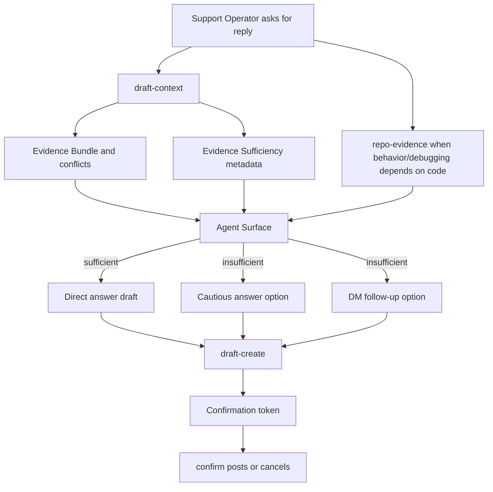

# feat: Add evidence-aware draft fallback

## Summary

Add evidence sufficiency metadata to reply context so Agent Surfaces can offer two draft options when evidence cannot support a confident direct answer. The Local Core reports answerability and reasons; the Agent Surface remains responsible for natural-language drafting, evidence display, and confirmation-gated posting.

---

## Problem Frame

The current reply workflow returns target history, thread context, evidence, conflicts, and a limited missing-history suggestion. It does not tell the Agent Surface whether the evidence is strong enough for a direct answer. That leaves the agent to choose between overconfident drafting and ad hoc fallback wording.

The origin requirements separate support truth from fallback action. “Ask the user to DM me” should shape a draft option only when evidence is insufficient, not become Manual Knowledge or rank as Evidence Bundle content.

---

## Requirements

**Evidence Sufficiency**

- R1. `draft-context` must return machine-readable evidence sufficiency metadata for reply drafting.
- R2. Sufficiency metadata must identify no evidence, weak evidence, conflicts, missing user history, and account-specific gaps as reasons the direct answer is limited.
- R3. Existing source-priority behavior must remain intact for Repository Evidence, Manual Knowledge Notes, Telegram evidence, and web evidence.
- R4. The sufficiency result must be visible in Agent Surface guidance before the operator chooses a draft option.

**Draft Fallback Workflow**

- R5. When evidence is sufficient, the reply workflow should draft one direct answer and avoid unnecessary DM fallback.
- R6. When evidence is insufficient or Repository Evidence returns a stale warning, the reply workflow must present a cautious evidence-limited answer option and a DM follow-up option.
- R7. The DM follow-up option must ask only for support-blocking missing information.
- R8. Fallback wording must not be saved as Manual Knowledge or emitted as Evidence Bundle truth.

**Safety and Compatibility**

- R9. Existing `draft-create` and `confirm` posting safety boundaries must remain unchanged.
- R10. Existing `search` behavior must not change except where shared helper behavior is intentionally reused by `draft-context`.
- R11. Agent-facing docs must keep Codex, Claude, and OpenAI companion surfaces aligned with the shared CLI/core behavior.

---

## Key Technical Decisions

- KTD1. **Core reports answerability; agents draft prose.** The Local Core should return deterministic sufficiency metadata, while Agent Surfaces compose the direct answer and DM follow-up in natural language.
- KTD2. **Heuristic first version.** Evidence sufficiency should start with transparent, testable signals from existing context output rather than an LLM-only judgment.
- KTD3. **No new source type.** Fallback Draft Options are not indexed, chunked, or stored as corpus sources; they remain workflow output.
- KTD4. **Extend `draft-context`, not `search`.** The fallback decision is reply-specific because it depends on target history, thread context, conflicts, and private/account-specific gaps.
- KTD5. **Documentation enforces two-option presentation.** The CLI cannot generate final prose today, so the skill and agent descriptors must explicitly tell agent surfaces how to use the sufficiency reasons.

---

## High-Level Technical Design

The Local Core owns evidence retrieval, conflicts, target context, and sufficiency reasons. The Agent Surface owns final wording and must show the sufficiency state before any `draft-create` call.

---

## Implementation Units

### U1. Add evidence sufficiency analysis to draft context

- **Goal:** Return structured answerability metadata from draft context without changing corpus retrieval semantics.
- **Requirements:** R1, R2, R3, R4; supports origin F1 and F2.
- **Dependencies:** None.
- **Files:** `tg_support/support/context.py`, `tests/test_cli_setup.py`, `tests/test_manual_knowledge.py`
- **Approach:** Add a small sufficiency analyzer that receives the existing evidence, conflicts, target history, thread, and query. It should return an answerability state, a list of reason codes, and short operator-facing reason text that explains why the agent should draft directly or offer fallback options.
- **Patterns to follow:** `draft_context` already centralizes target history, thread, evidence, conflicts, and missing-history suggestions. Keep the JSON plain and deterministic, matching existing CLI outputs.
- **Test scenarios:**
  - Covers AE1. Given relevant evidence is returned and no conflicts are present, when `draft_context` runs, then sufficiency reports a direct answerable state.
  - Covers AE2. Given retrieval returns no evidence, when `draft_context` runs, then sufficiency reports insufficient evidence with a no-evidence reason.
  - Covers AE3. Given Manual Knowledge conflicts are returned, when `draft_context` runs, then sufficiency reports insufficient evidence with a conflict reason.
  - Given a target username has no local history, when `draft_context` runs, then sufficiency includes a missing-user-history reason alongside the existing suggestion.
- **Verification:** `draft_context` callers receive stable sufficiency fields while existing evidence and conflict payloads remain present and source-linked.

### U2. Model account-specific and private-detail gaps as fallback reasons

- **Goal:** Detect common account-specific requests that should offer a DM follow-up when evidence alone cannot answer.
- **Requirements:** R2, R6, R7, R8; supports origin F2 and F3.
- **Dependencies:** U1.
- **Files:** `tg_support/support/context.py`, `tests/test_cli_setup.py`
- **Approach:** Add conservative query/thread heuristics for missing private or account-specific details. Keep the first version biased toward surfacing a fallback option only when the operator or user context indicates a needed identifier, log, email, billing detail, screenshot, or account-specific state.
- **Patterns to follow:** Existing local helpers return structured suggestions instead of hidden prompt-only behavior. Preserve that posture by returning reason codes rather than final prose.
- **Test scenarios:**
  - Covers AE4. Given the query asks for a private account email and no evidence can answer the account state, when `draft_context` runs, then sufficiency includes an account-specific gap reason.
  - Given the query is a general product question with relevant evidence, when `draft_context` runs, then account-specific fallback is not triggered by generic words alone.
  - Given thread text mentions logs or screenshots needed to diagnose a user's issue, when `draft_context` runs, then sufficiency marks the missing-detail fallback as available.
- **Verification:** Fallback reasons are conservative and do not turn generic product-support searches into unnecessary DM requests.

### U3. Update reply workflow instructions for two-option drafting

- **Goal:** Teach Agent Surfaces to use sufficiency metadata when drafting replies.
- **Requirements:** R4, R5, R6, R7, R8, R9, R11; supports origin F1, F2, and F3.
- **Dependencies:** U1, U2.
- **Files:** `skills/telegram-support/SKILL.md`, `skills/telegram-support/references/reply-workflow.md`, `agents/openai.yaml`, `agents/claude.md`, `tests/test_cli_setup.py`
- **Approach:** Update the reply workflow so agents show sufficiency status with the evidence summary. If direct-answerable, draft normally. If insufficient, or if Repository Evidence returns a stale warning for a behavior/debugging answer, present both a cautious evidence-limited answer and a DM follow-up option, then create only the operator-selected exact draft.
- **Patterns to follow:** Existing Manual Knowledge and Repository Evidence instructions already require warnings and conflicts to be shown before drafting. Keep the new fallback language in that same operator-visible evidence section.
- **Test scenarios:**
  - Covers AE1. Given workflow docs mention sufficient evidence, then they direct the agent to prepare a direct answer without fallback.
  - Covers AE2 and AE4. Given workflow docs mention insufficient evidence, then they require two options and a DM follow-up for missing private or account-specific information.
  - Covers AE5. Given workflow docs mention DM fallback, then they forbid saving fallback wording as Manual Knowledge.
  - Covers AE6. Given workflow docs mention either option, then they keep `draft-create` and `confirm` as the only posting path.
  - Given Repository Evidence returns a stale warning, then workflow docs require that warning to shape the fallback choice instead of hiding it inside a direct answer.
- **Verification:** Agent-facing docs and descriptor tests prove all supported surfaces reference sufficiency metadata and preserve confirmation-gated posting.

### U4. Preserve draft persistence and knowledge boundaries

- **Goal:** Ensure fallback options remain workflow choices and never become corpus evidence or durable knowledge by accident.
- **Requirements:** R8, R9, R10; supports origin F3.
- **Dependencies:** U1, U3.
- **Files:** `tg_support/support/drafting.py`, `tg_support/support/knowledge.py`, `tests/test_manual_knowledge.py`, `tests/test_posting_confirmation.py`
- **Approach:** Avoid schema changes unless implementation reveals that existing draft evidence JSON cannot carry selected-option metadata. If selected-option metadata is added, keep it inside the draft evidence payload and do not add a new chunk/source path.
- **Patterns to follow:** Manual Knowledge saves already require the explicit `knowledge-add` path. Drafts already persist exact message text and evidence separately from indexed source records.
- **Test scenarios:**
  - Covers AE5. Given a DM fallback option is selected for a draft, when the draft is created, then no Manual Knowledge Note is created.
  - Given fallback metadata is attached to a draft evidence payload, when indexing runs, then no new manual or evidence source is created from that metadata.
  - Covers AE6. Given a fallback draft has a post token, when the operator has not confirmed it, then no Telegram message is sent.
- **Verification:** Existing posting confirmation tests still pass, and new tests prove fallback draft data cannot enter indexed knowledge.

### U5. Update operator documentation

- **Goal:** Document evidence-aware fallback behavior for operators without presenting it as a knowledge-base feature.
- **Requirements:** R4, R5, R6, R8, R11.
- **Dependencies:** U1, U3.
- **Files:** `README.md`, `docs/setup.md`, `docs/claude-usage.md`, `CONCEPTS.md`, `tests/test_cli_setup.py`
- **Approach:** Add concise operator-facing documentation explaining that weak or missing evidence can produce two reply choices. Emphasize that DM fallback wording is not saved as Manual Knowledge and does not resolve evidence conflicts.
- **Patterns to follow:** Existing docs explain Manual Knowledge and Repository Evidence in separate sections with source-priority language. Add the fallback behavior near reply drafting, not inside Manual Knowledge.
- **Test scenarios:**
  - Given operator docs describe reply drafting, then they mention evidence sufficiency and the two-option fallback.
  - Given docs describe Manual Knowledge, then they do not imply DM fallback text should be saved as a Manual Knowledge Note.
  - Given `CONCEPTS.md` defines Evidence Sufficiency and Fallback Draft Option, then docs use those canonical terms consistently.
- **Verification:** Documentation tests assert the new operator-facing behavior and truth boundary are present.

---

## Scope Boundaries

### In Scope

- Machine-readable sufficiency metadata on draft context.
- Deterministic first-version heuristics for no evidence, weak evidence, conflicts, missing user history, and account-specific gaps.
- Agent workflow handling for stale Repository Evidence warnings.
- Agent workflow updates that present direct or two-option drafting paths.
- Tests that prove fallback wording does not become Manual Knowledge or evidence.
- Operator documentation for the new reply behavior.

### Deferred to Follow-Up Work

- Editable saved preference rules for reply style.
- Custom templates for different DM follow-up wording.
- Analytics on fallback frequency or operator choice rates.
- LLM-assisted sufficiency scoring calibrated against operator decisions.

### Outside This Product's Identity

- Saving DM fallback text as source-of-truth knowledge.
- Letting fallback guidance resolve evidence conflicts.
- Posting a selected option without explicit operator confirmation.

---

## System-Wide Impact

This change affects the boundary between deterministic Local Core output and agent-authored reply prose. The Local Core gains answerability metadata, while Agent Surfaces keep the human-facing drafting and confirmation workflow.

The plan preserves the local-first profile model. It does not introduce hosted state, new external services, or a new evidence source type.

---

## Risks & Dependencies

- **Over-triggered fallback:** Broad heuristics could offer DM unnecessarily. Mitigate with conservative account-specific signals and tests for general product questions.
- **Under-triggered fallback:** Narrow heuristics may miss weak-evidence cases. Mitigate by treating conflicts, empty evidence, missing target history, and stale Repository Evidence warnings as explicit first-version reasons.
- **Agent-surface drift:** Updating one surface but not another would produce inconsistent behavior. Mitigate with descriptor and documentation tests.
- **Evidence pollution:** Storing fallback wording in Manual Knowledge would recreate the original problem. Mitigate with explicit tests around `knowledge-add`, indexing, and draft persistence.

---

## Acceptance Examples

- AE1. Given retrieved evidence directly answers a support question, when `draft-context` returns sufficiency metadata, then the reply workflow drafts a direct answer and does not add a DM fallback.
- AE2. Given no relevant evidence is returned, when `draft-context` runs, then sufficiency indicates insufficient evidence and the workflow presents both a cautious answer and a DM follow-up.
- AE3. Given Manual Knowledge conflicts with other evidence, when `draft-context` runs, then sufficiency indicates conflict-limited evidence and the workflow does not treat a DM option as conflict resolution.
- AE4. Given the answer depends on a private account email, when the workflow prepares options, then the DM follow-up asks for that missing detail and the summary says the fallback was triggered by evidence insufficiency.
- AE5. Given a DM fallback option is generated or selected, when the workflow completes, then no Manual Knowledge Note is created and no fallback text is indexed as evidence.
- AE6. Given either draft option exists, when the operator has not confirmed posting, then no Telegram message is sent.

---

## Documentation / Operational Notes

The CLI output should remain JSON-only and backwards-readable for agents that ignore unknown fields. Existing consumers can continue using `context.evidence`, `context.conflicts`, `context.history`, `context.thread`, and `context.suggestion`; updated surfaces should also read the new sufficiency metadata.

The reply workflow docs should name fallback options as operator choices, not as source records. This keeps Manual Knowledge semantics reserved for confirmed support truth.

---

## Sources / Research

- `docs/brainstorms/2026-06-26-evidence-aware-draft-fallback-requirements.md` is the origin requirements document.
- `CONCEPTS.md` defines Evidence Sufficiency and Fallback Draft Option alongside existing support-domain terms.
- `tg_support/support/context.py` is the current draft-context boundary for target history, thread context, evidence, conflicts, and suggestions.
- `tg_support/indexing/hybrid.py` owns existing search, source-priority behavior, and Manual Knowledge conflict output.
- `tg_support/support/repository_evidence.py` returns Repository Evidence, stale warnings, branch, revision, and code citations for behavior/debugging answers.
- `tg_support/support/drafting.py` persists exact draft text and evidence before confirmation.
- `tg_support/support/knowledge.py` saves Manual Knowledge only through the explicit manual note path.
- `skills/telegram-support/references/reply-workflow.md` is the current agent-facing reply workflow.
- `docs/solutions/architecture-patterns/thin-agent-surfaces-shared-local-cli-core.md` establishes that new support behavior belongs in the shared Local Core first, with agent surfaces remaining thin.
