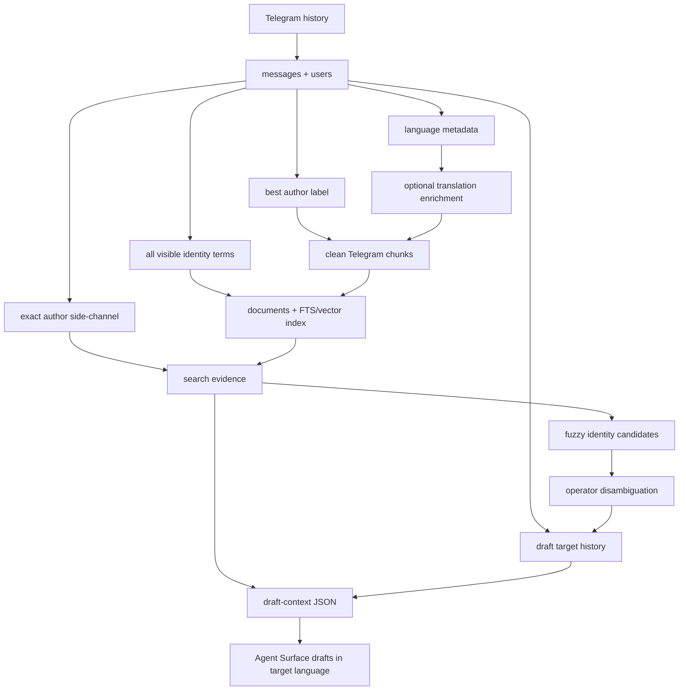

# feat: Improve Telegram author and language retrieval

## Summary

Extend Telegram indexing, retrieval, and draft context so Telegram authors are searchable by handle/username and display name. Exact author lookup remains a database-backed side-channel, all visible author identities are included in embedding-visible Telegram evidence text, fuzzy author identity search runs only when exact author lookup finds nothing, and multilingual support evidence carries language and optional English helper context without replacing the original text.

---

## Problem Frame

The current Telegram support corpus still treats `messages.author_username` as the primary author identity. The first display-name fix only uses `users.display_name` when `messages.author_username` is absent, which misses users such as `Anon` when the operator searches a visible display name but the Telegram author also has a separate handle.

Normal search is also constrained by what the index can see. Telegram `chunks.text` is projected into `documents.text`, and embeddings are built from `documents.text`, so semantic retrieval cannot see alternate author identities unless username and display-name terms are present in the embedded Telegram payload. Chunk display text can keep showing the best author label, but the embedded payload needs all visible identity fields.

Chunk rendering also indexes empty neighbor messages as standalone `author:` lines. Non-English messages are stored as original text, but draft context does not expose language metadata or translated helper context that would let an Agent Surface understand the evidence while replying in the user's original language.

---

## Requirements

**Author Identity**

- R1. Telegram chunking uses `author_username`, then linked `users.display_name`, then `unknown` as the author label.
- R2. Telegram chunk metadata preserves the same best author label used in rendered chunk text.
- R3. Draft target history lookup matches the requested user string exactly against both `author_username` and linked `users.display_name`.
- R4. Exact author boosting uses an explicit requested author identity, separate from free-text query text.
- R15. Fuzzy author identity search can match username and display name only after exact author lookup returns no author evidence.
- R16. Fuzzy author identity search uses index-visible identity terms, not only rendered chunk text.
- R17. Draft context requires exact author identity or explicit disambiguation before fuzzy-matched history becomes target history.
- R18. Telegram document text sent to the embedding model includes every visible author identity for the source message: username when present, display name when present, or both when both exist.

**Chunk Quality**

- R5. Telegram chunk text skips empty or whitespace-only messages.
- R6. Telegram chunk text does not include standalone `unknown:` or `<author>:` lines with no message content.
- R7. Telegram evidence remains traceable to original message IDs, timestamps, source IDs, and source text.

**Language And Translation Context**

- R8. Telegram indexing can attach source-language metadata to message-derived chunks.
- R9. English translations are derived helper context, stored separately from original Telegram text.
- R10. Search can match original text and translated helper text when translation metadata is available.
- R11. Evidence output preserves original Telegram text and may include translated helper context.
- R12. Draft context exposes inferred language for target messages or target user history when known.
- R13. Agent Surface instructions draft replies in the Support User's original language when it can be inferred.
- R14. If target language is uncertain, the Agent Surface shows the language assumption before posting.

---

## Key Technical Decisions

- **KTD1. Resolve author identity in the Local Core:** Author lookup, chunk rendering, indexed identity terms, and draft context should join source messages to users rather than teaching Agent Surfaces separate username/display-name rules.
- **KTD2. Keep exact author matching as a side-channel:** Exact author lookup should query canonical user/message identity fields and join back to Telegram documents, so it does not depend on chunk text.
- **KTD6. Gate fuzzy author search behind exact misses:** Fuzzy identity search should run only when exact author matching returns no author evidence, and its hits are candidates until draft context receives an exact match or disambiguation.
- **KTD3. Keep translation as enrichment:** The first implementation should add language metadata and translation-provider seams, with a fake provider for tests, but defer choosing a real automatic translation service.
- **KTD4. Keep original text authoritative:** Original Telegram text remains the chunk/evidence source of truth; translated text is searchable helper context and drafting aid.
- **KTD5. Keep reply prose in Agent Surfaces:** The CLI returns language and evidence metadata, while Codex/Claude compose natural-language replies and keep the confirmation boundary unchanged.

---

## High-Level Technical Design

The retrieval projection remains rebuildable. Source messages and users stay durable profile data, while clean chunk text, best author labels, embedding-visible identity terms, language metadata, and derived translation text are index-time projections that can be rebuilt. Exact author matches come from the user/message relationship; fuzzy author matches come from identity terms visible to FTS and embeddings.

---

## Implementation Units

### U1. Best author label storage helpers

- **Goal:** Centralize the logic for resolving a Telegram message's visible author label from username, display name, or `unknown`.
- **Requirements:** R1, R2, R3, R4
- **Dependencies:** None
- **Files:** `tg_support/storage/db.py`, `tests/test_storage.py`, `tests/conftest.py`
- **Approach:** Add storage-layer query helpers that return message rows with a computed best author label and preserve existing source identifiers. Keep the label resolution close to source data so chunking, search, stats, and draft context can share the same semantics.
- **Execution note:** Start with characterization tests for a message whose `author_username` is null and linked user `display_name` is `crinx7`.
- **Patterns to follow:** `SupportDatabase.telegram_documents_by_author_username` already owns metadata-backed author document lookup; `SupportDatabase.rebuild_documents` shows how chunk metadata becomes document metadata.
- **Test scenarios:**
  - Given a message with `author_username = "alice"`, best author label is `alice`.
  - Given a message with `author_username = null` and linked display name `crinx7`, best author label is `crinx7`.
  - Given a message with no username and no display name, best author label is `unknown`.
  - Given display-name-backed source messages exist, storage helpers return original Telegram message IDs and timestamps unchanged.
- **Verification:** Storage tests prove author label resolution works without changing source message records.

### U2. Clean Telegram chunk rendering

- **Goal:** Rebuild Telegram chunk text and metadata with best author labels, embedding-visible identity terms, and no empty author-only lines.
- **Requirements:** R1, R2, R5, R6, R7, R16, R18
- **Dependencies:** U1
- **Files:** `tg_support/indexing/chunking.py`, `tests/test_chunking.py`, `tests/test_storage.py`
- **Approach:** Update message chunking to fetch best author labels and all visible identity terms for the focal message and its neighbors. Keep rendered chunk lines readable, skip neighbors whose text is empty after trimming, and make username/display-name identity terms available to the Telegram document text that FTS and vector embeddings consume.
- **Execution note:** Add failing chunking tests using a mixed window with empty `yonghengyige` messages and a display-name-only `crinx7` message.
- **Patterns to follow:** `chunk_manual_notes` stores source metadata alongside text, and `test_telegram_chunks_include_neighboring_context` already verifies neighboring conversation context.
- **Test scenarios:**
  - Covers origin AE1. A display-name-only author renders as `crinx7:` in chunk text and `metadata.author`.
  - Covers origin AE6. Empty messages in the neighbor window do not render as blank `author:` lines.
  - Given an author has username `helper123` and display name `Anon`, the embedded Telegram document text contains both identity terms even if returned evidence text shows only the best author label.
  - Given a window contains non-empty messages before and after the focal message, useful neighboring context remains present.
  - Given a message has no visible author label, non-empty text still renders with `unknown:` so evidence is not orphaned.
- **Verification:** Chunking and indexing tests prove the embedded Telegram payload includes identity terms for search while displayed evidence remains clean and source traceable.

### U3. Exact author side-channel and draft targeting

- **Goal:** Make retrieval with author identity `Anon` or `@crinx7`, and `draft-context --user Anon`, work when the requested identity exactly matches either username or display name.
- **Requirements:** R3, R4, R17
- **Dependencies:** U1, U2
- **Files:** `tg_support/storage/db.py`, `tg_support/indexing/hybrid.py`, `tg_support/support/context.py`, `tests/test_hybrid_retrieval.py`, `tests/test_cli_setup.py`
- **Approach:** Add an explicit author identity input to retrieval and use it to match canonical identity fields through the user/message relationship, not chunk text. Exact hits should join from matched users to authored messages and then to Telegram documents, while `user_history` should use the same exact identity semantics and keep result shape unchanged for Evidence Bundle consumers.
- **Patterns to follow:** The existing username exact-match boost plan uses retriever-level rank boosting and avoids raw text mentions; this unit extends that same metadata-backed path.
- **Test scenarios:**
  - Covers origin AE2. `draft-context --user Anon` returns target history when `Anon` exactly matches display name and the same author also has username `helper123`.
  - Covers origin AE4. Search with author identity `crinx7` or `@crinx7` boosts display-name-authored Telegram evidence above unrelated semantic results even when the author has a separate username.
  - Covers origin AE5. A message that merely mentions `crinx7` in text is not treated as an author match.
  - Given an author has both username and display name, exact queries for either value resolve to that author's Telegram evidence.
  - Given CLI search returns a display-name author match, the JSON result remains a normal Telegram evidence record.
- **Verification:** Retrieval and CLI tests show search and draft context recover exact username/display-name evidence without adding a separate user lookup command.

### U6. Fuzzy author identity fallback

- **Goal:** Let normal search find likely author identities by approximate username or display-name match only when exact author matching returns no author evidence.
- **Requirements:** R15, R16, R17, R18
- **Dependencies:** U2, U3
- **Files:** `tg_support/indexing/chunking.py`, `tg_support/indexing/hybrid.py`, `tg_support/storage/db.py`, `tg_support/support/context.py`, `tests/test_hybrid_retrieval.py`, `tests/test_cli_setup.py`
- **Approach:** Add index-visible author identity terms for Telegram documents so FTS and vector retrieval can match approximate username or display-name inputs. Search should prefer exact author side-channel results when present, and only use fuzzy author identity candidates when exact author lookup returns no author evidence. Draft context may expose fuzzy candidates or suggestions, but it must not treat them as target history until an exact identity or explicit disambiguation resolves the target.
- **Patterns to follow:** `SupportDatabase._fts_text` already enriches FTS text with derived metadata such as `translated_text`; `HybridRetriever._fused_search` already combines side-channel candidates with lexical and vector retrieval while preserving normal Evidence Bundle result shape.
- **Test scenarios:**
  - Covers origin AE10. Given no exact author identity matches `Ann`, when fuzzy search finds indexed identity term `Anon`, then search may return `Anon` evidence as a candidate.
  - Covers origin AE10. Given `draft-context --user Ann` finds only fuzzy identity candidates, then target history remains empty and evidence sufficiency still reports missing target history or a disambiguation need.
  - Given exact author lookup returns evidence for `Anon`, fuzzy identity fallback does not reorder or replace the exact side-channel results.
  - Given username `helper123` and display name `Anon` are indexed for the same author, fuzzy queries near either field can recover the source-linked Telegram evidence.
  - Given another user's message text mentions `Anon`, that text mention is not treated as exact target history.
- **Verification:** Retrieval and CLI tests prove exact author matches win first, fuzzy author identity matches are discoverable only through indexed identity terms, and draft context keeps fuzzy candidates separate from target history.

### U4. Language metadata and translation enrichment seam

- **Goal:** Add a rebuildable metadata path for source language and optional English helper translation without choosing a production translation provider.
- **Requirements:** R8, R9, R10, R11, R12
- **Dependencies:** U2
- **Files:** `tg_support/indexing/chunking.py`, `tg_support/storage/db.py`, `tg_support/support/context.py`, `tests/test_chunking.py`, `tests/test_hybrid_retrieval.py`, `tests/test_cli_setup.py`
- **Approach:** Introduce a small translation/language enrichment boundary that can annotate Telegram chunks with `source_language` and `translated_text` when available. Index translated helper text alongside original text for retrieval, but preserve original Telegram text in evidence output.
- **Execution note:** Use a fake enrichment provider in tests; defer production provider choice to follow-up work.
- **Patterns to follow:** Manual Knowledge Note metadata is stored as structured JSON on chunks and documents, and retrieval already returns `metadata` to Agent Surfaces.
- **Test scenarios:**
  - Covers origin AE7. A Chinese message with fake English translation can be found by an English query while returned evidence still contains original Chinese text.
  - Given a non-English message has `source_language`, draft context includes that language in target or evidence metadata.
  - Given no translation is available, original text remains indexed and evidence output remains valid.
  - Given a translation is present, `translated_text` is returned as helper metadata and not substituted into the primary evidence `text`.
- **Verification:** Tests prove translation metadata is additive, searchable when present, and does not overwrite source evidence.

### U5. Agent Surface reply-language guidance

- **Goal:** Update agent-facing workflows so draft replies default to the Support User's original language when draft context can infer it.
- **Requirements:** R13, R14
- **Dependencies:** U4
- **Files:** `skills/telegram-support/SKILL.md`, `skills/telegram-support/references/reply-workflow.md`, `agents/claude.md`, `agents/openai.yaml`, `docs/setup.md`, `tests/test_cli_setup.py`
- **Approach:** Document that English helper translations are for operator understanding, while final reply text should match the target language when known. Require the Agent Surface to show uncertain language assumptions before creating a draft.
- **Patterns to follow:** Existing reply workflow already makes evidence sufficiency, conflicts, stale repository warnings, exact draft text, and post/cancel choices visible before posting.
- **Test scenarios:**
  - Covers origin AE8. Workflow docs instruct the agent to draft in Chinese when target context language is Chinese.
  - Covers origin AE9. Workflow docs instruct the agent to surface uncertain language assumptions before posting.
  - Given `draft-context` includes language metadata, CLI output shape remains backwards-compatible for consumers that ignore it.
  - Given a fallback DM draft is needed, language guidance still applies to both cautious and DM follow-up options.
- **Verification:** Documentation and CLI shape tests prove Agent Surfaces receive enough metadata and instructions to preserve the user's language without changing the posting confirmation flow.

---

## Scope Boundaries

- This plan does not add a participant directory or separate user-profile lookup UI.
- This plan does not allow fuzzy author matches to become draft targets without exact match or disambiguation.
- This plan does not change Manual Knowledge Note truth, Conflict Check behavior, or Repository Evidence priority.
- This plan does not choose or wire a production translation provider.
- This plan does not make the CLI generate final natural-language reply prose.
- This plan does not change Telegram posting confirmation requirements.

### Deferred to Follow-Up Work

- Choose and configure a production translation provider if automatic translation becomes required.
- Add richer CJK tokenization or language-specific FTS behavior if translation metadata is not enough for search quality.
- Add operator controls for enabling, disabling, or refreshing translation enrichment.

---

## System-Wide Impact

The change stays inside the shared Local Core and thin Agent Surface model. Storage, chunking, hybrid retrieval, draft context, and workflow docs all need consistent author and language semantics so Codex and Claude do not diverge.

Indexes are rebuildable projections, so corrected author labels, indexed identity terms, and translation helper fields should be regenerated by re-running `index`. Source Telegram messages, users, drafts, confirmations, and post attempts remain durable profile data.

---

## Risks & Dependencies

- **Display-name ambiguity:** Telegram display names are not globally unique. The plan mitigates this by treating exact matches as source-linked evidence and keeping fuzzy matches as candidates until exact identity or disambiguation resolves draft targeting.
- **Index visibility:** Fuzzy author identity search cannot work from `users` fields alone because FTS and embeddings are built from the document payload. The plan mitigates this by adding embedding-visible identity terms while keeping rendered evidence clean.
- **Translation distortion:** English helper translations can distort support details. The plan keeps original text as source truth and treats translations as helper metadata.
- **Index drift:** Existing profiles need re-indexing before cleaned chunks and translation metadata appear. The content signature in index runs should detect changed chunk text or metadata.
- **Agent prompt drift:** Reply-language behavior could diverge across surfaces if only one skill is updated. The plan updates Codex, Claude, and OpenAI surface guidance.

---

## Acceptance Examples

- AE1. Given a display-name-only `crinx7` message, indexing renders and returns Telegram evidence with author `crinx7`.
- AE2. Given `Anon` exactly matches display name while the author also has username `helper123`, `draft-context --user Anon` includes that user's history.
- AE3. Given an author has username `helper123` and display name `Anon`, the Telegram document text sent to the embedding model includes both `helper123` and `Anon`.
- AE4. Given display-name-authored Telegram evidence exists, searching with author identity `crinx7` or `@crinx7` boosts that evidence above unrelated results even when the author has a separate username.
- AE5. Given unrelated text mentions `crinx7`, the mention is not treated as an author match.
- AE6. Given empty Telegram messages in a context window, chunk text omits blank author-only lines.
- AE7. Given a Chinese Telegram message with an English helper translation, English search can recover the original Telegram evidence.
- AE8. Given target context language is Chinese, Agent Surface guidance produces a Chinese reply draft.
- AE9. Given target language is uncertain, the Agent Surface shows the language assumption before creating or posting a draft.
- AE10. Given no exact author identity matches a query, fuzzy search can surface indexed author identity candidates without using them as draft target history.

---

## Documentation / Operational Notes

Operator command names do not change. Existing profiles should run `index` after the code ships so document text, FTS rows, embeddings, and metadata reflect author identity terms, display-name author labels, empty-line cleanup, and any configured language enrichment.

Reply workflow docs should explain that translations are helper context. Evidence summaries should preserve original Telegram source text, and final replies should use the Support User's language when known.

---

## Sources / Research

- `docs/brainstorms/2026-06-26-display-name-author-retrieval-requirements.md` defines the origin requirements and acceptance examples.
- `docs/plans/2026-06-26-002-feat-username-exact-match-boost-plan.md` established metadata-backed username boosting inside the retriever.
- `docs/solutions/architecture-patterns/thin-agent-surfaces-shared-local-cli-core.md` requires support behavior to stay in `tg_support/` with thin Codex/Claude surfaces.
- `tg_support/storage/db.py` stores `users.username`, `users.display_name`, `messages.author_username`, source messages, chunk metadata, and document projections.
- `tg_support/indexing/chunking.py` renders Telegram chunks from best author labels and neighboring context while storing all visible author identities in metadata.
- `tg_support/indexing/vector.py` embeds `DocumentRecord.text`, so author identity terms must be present there rather than only in metadata.
- `tg_support/indexing/hybrid.py` owns exact author boost integration and Evidence Bundle result shaping.
- `tg_support/support/context.py` owns `draft-context`, target history, thread context, evidence sufficiency, and the missing-history reason.
- `skills/telegram-support/references/reply-workflow.md`, `skills/telegram-support/SKILL.md`, `agents/claude.md`, and `agents/openai.yaml` define Agent Surface reply behavior and posting safety.
