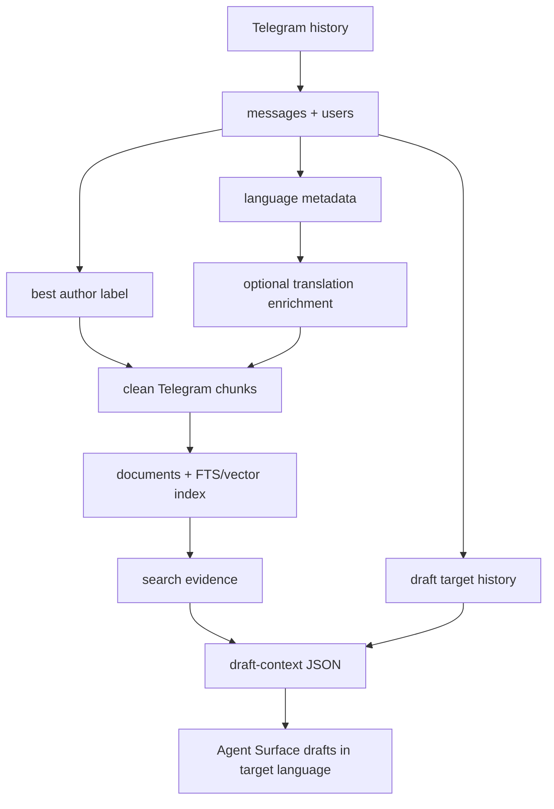

# feat: Improve Telegram author and language retrieval

## Summary

Extend Telegram indexing, retrieval, and draft context so visible display-name authors are searchable when Telegram usernames are absent, noisy blank message lines are removed from chunks, and multilingual support evidence carries language and optional English helper context without replacing the original text.

---

## Problem Frame

The current Telegram support corpus treats `messages.author_username` as the only searchable author identity. Users such as `crinx7` can exist in `users.display_name` while their source message has no `author_username`, which causes chunks to render `unknown:` and makes `draft-context --user crinx7` report missing history even though the user and support exchange are present.

Chunk rendering also indexes empty neighbor messages as standalone `author:` lines. Non-English messages are stored as original text, but draft context does not expose language metadata or translated helper context that would let an Agent Surface understand the evidence while replying in the user's original language.

---

## Requirements

**Author Identity**

- R1. Telegram chunking uses `author_username`, then linked `users.display_name`, then `unknown` as the author label.
- R2. Telegram chunk metadata preserves the same best author label used in rendered chunk text.
- R3. Draft target history lookup matches `author_username` and display name when username is absent.
- R4. Exact author boosting includes Telegram documents whose linked display name matches the query when `author_username` is absent.

**Chunk Quality**

- R5. Telegram chunk text skips empty or whitespace-only messages.
- R6. Telegram chunk text does not include standalone `unknown:` or `<author>:` lines with no message content.
- R7. Telegram evidence remains traceable to original message IDs, timestamps, source IDs, and source text.

**Language And Translation Context**

- R8. Telegram indexing can attach source-language metadata to message-derived chunks.
- R9. English translations are derived helper context, stored separately from original Telegram text.
- R10. Search can match original text and translated helper text when translation metadata is available.
- R11. Evidence output preserves original Telegram text and may include translated helper context.
- R12. Draft context exposes inferred language for target messages or target user history when known.
- R13. Agent Surface instructions draft replies in the Support User's original language when it can be inferred.
- R14. If target language is uncertain, the Agent Surface shows the language assumption before posting.

---

## Key Technical Decisions

- **KTD1. Resolve visible author labels in the Local Core:** Author lookup and chunk rendering should join source messages to users rather than teaching Agent Surfaces separate username/display-name rules.
- **KTD2. Preserve exact author matching:** Display-name matching applies as a fallback author identity when `author_username` is absent, not as broad fuzzy people search.
- **KTD3. Keep translation as enrichment:** The first implementation should add language metadata and translation-provider seams, with a fake provider for tests, but defer choosing a real automatic translation service.
- **KTD4. Keep original text authoritative:** Original Telegram text remains the chunk/evidence source of truth; translated text is searchable helper context and drafting aid.
- **KTD5. Keep reply prose in Agent Surfaces:** The CLI returns language and evidence metadata, while Codex/Claude compose natural-language replies and keep the confirmation boundary unchanged.

---

## High-Level Technical Design

The retrieval projection remains rebuildable. Source messages and users stay durable profile data, while clean chunk text, best author labels, language metadata, and derived translation text are index-time projections that can be rebuilt.

---

## Implementation Units

### U1. Best author label storage helpers

- **Goal:** Centralize the logic for resolving a Telegram message's visible author label from username, display name, or `unknown`.
- **Requirements:** R1, R2, R3, R4
- **Dependencies:** None
- **Files:** `tg_support/storage/db.py`, `tests/test_storage.py`, `tests/conftest.py`
- **Approach:** Add storage-layer query helpers that return message rows with a computed best author label and preserve existing source identifiers. Keep the label resolution close to source data so chunking, search, stats, and draft context can share the same semantics.
- **Execution note:** Start with characterization tests for a message whose `author_username` is null and linked user `display_name` is `crinx7`.
- **Patterns to follow:** `SupportDatabase.telegram_documents_by_author_username` already owns metadata-backed author document lookup; `SupportDatabase.rebuild_documents` shows how chunk metadata becomes document metadata.
- **Test scenarios:**
  - Given a message with `author_username = "alice"`, best author label is `alice`.
  - Given a message with `author_username = null` and linked display name `crinx7`, best author label is `crinx7`.
  - Given a message with no username and no display name, best author label is `unknown`.
  - Given display-name-backed source messages exist, storage helpers return original Telegram message IDs and timestamps unchanged.
- **Verification:** Storage tests prove author label resolution works without changing source message records.

### U2. Clean Telegram chunk rendering

- **Goal:** Rebuild Telegram chunk text and metadata with best author labels and without empty author-only lines.
- **Requirements:** R1, R2, R5, R6, R7
- **Dependencies:** U1
- **Files:** `tg_support/indexing/chunking.py`, `tests/test_chunking.py`, `tests/test_storage.py`
- **Approach:** Update message chunking to fetch best author labels for the focal message and its neighbors. Skip neighbors whose text is empty after trimming, and use the best author label in both rendered chunk lines and metadata.
- **Execution note:** Add failing chunking tests using a mixed window with empty `yonghengyige` messages and a display-name-only `crinx7` message.
- **Patterns to follow:** `chunk_manual_notes` stores source metadata alongside text, and `test_telegram_chunks_include_neighboring_context` already verifies neighboring conversation context.
- **Test scenarios:**
  - Covers origin AE1. A display-name-only author renders as `crinx7:` in chunk text and `metadata.author`.
  - Covers origin AE5. Empty messages in the neighbor window do not render as blank `author:` lines.
  - Given a window contains non-empty messages before and after the focal message, useful neighboring context remains present.
  - Given a message has no visible author label, non-empty text still renders with `unknown:` so evidence is not orphaned.
- **Verification:** Chunking tests prove the indexed Telegram text is cleaner while source traceability remains intact.

### U3. Display-name author search and draft targeting

- **Goal:** Make `search crinx7`, `search @crinx7`, and `draft-context --user crinx7` work when `crinx7` is stored as a display name rather than a username.
- **Requirements:** R3, R4
- **Dependencies:** U1, U2
- **Files:** `tg_support/storage/db.py`, `tg_support/indexing/hybrid.py`, `tg_support/support/context.py`, `tests/test_hybrid_retrieval.py`, `tests/test_cli_setup.py`
- **Approach:** Extend exact author candidate lookup to match display name only when `author_username` is absent. Extend `user_history` to use the same best-author semantics, and keep result shape unchanged for Evidence Bundle consumers.
- **Patterns to follow:** The existing username exact-match boost plan uses retriever-level rank boosting and avoids raw text mentions; this unit extends that same metadata-backed path.
- **Test scenarios:**
  - Covers origin AE2. `draft-context --user crinx7` returns target history when `crinx7` exists only as display name.
  - Covers origin AE3. `search crinx7` and `search @crinx7` boost display-name-authored Telegram evidence above unrelated semantic results.
  - Covers origin AE4. A message that merely mentions `crinx7` in text is not treated as an author match.
  - Given an author has both username and display name, exact username semantics continue to use the username path.
  - Given CLI search returns a display-name author match, the JSON result remains a normal Telegram evidence record.
- **Verification:** Retrieval and CLI tests show search and draft context recover display-name-authored evidence without adding a separate user lookup command.

### U4. Language metadata and translation enrichment seam

- **Goal:** Add a rebuildable metadata path for source language and optional English helper translation without choosing a production translation provider.
- **Requirements:** R8, R9, R10, R11, R12
- **Dependencies:** U2
- **Files:** `tg_support/indexing/chunking.py`, `tg_support/storage/db.py`, `tg_support/support/context.py`, `tests/test_chunking.py`, `tests/test_hybrid_retrieval.py`, `tests/test_cli_setup.py`
- **Approach:** Introduce a small translation/language enrichment boundary that can annotate Telegram chunks with `source_language` and `translated_text` when available. Index translated helper text alongside original text for retrieval, but preserve original Telegram text in evidence output.
- **Execution note:** Use a fake enrichment provider in tests; defer production provider choice to follow-up work.
- **Patterns to follow:** Manual Knowledge Note metadata is stored as structured JSON on chunks and documents, and retrieval already returns `metadata` to Agent Surfaces.
- **Test scenarios:**
  - Covers origin AE6. A Chinese message with fake English translation can be found by an English query while returned evidence still contains original Chinese text.
  - Given a non-English message has `source_language`, draft context includes that language in target or evidence metadata.
  - Given no translation is available, original text remains indexed and evidence output remains valid.
  - Given a translation is present, `translated_text` is returned as helper metadata and not substituted into the primary evidence `text`.
- **Verification:** Tests prove translation metadata is additive, searchable when present, and does not overwrite source evidence.

### U5. Agent Surface reply-language guidance

- **Goal:** Update agent-facing workflows so draft replies default to the Support User's original language when draft context can infer it.
- **Requirements:** R13, R14
- **Dependencies:** U4
- **Files:** `skills/telegram-support/SKILL.md`, `skills/telegram-support/references/reply-workflow.md`, `agents/claude.md`, `agents/openai.yaml`, `docs/setup.md`, `tests/test_cli_setup.py`
- **Approach:** Document that English helper translations are for operator understanding, while final reply text should match the target language when known. Require the Agent Surface to show uncertain language assumptions before creating a draft.
- **Patterns to follow:** Existing reply workflow already makes evidence sufficiency, conflicts, stale repository warnings, exact draft text, and post/cancel choices visible before posting.
- **Test scenarios:**
  - Covers origin AE7. Workflow docs instruct the agent to draft in Chinese when target context language is Chinese.
  - Covers origin AE8. Workflow docs instruct the agent to surface uncertain language assumptions before posting.
  - Given `draft-context` includes language metadata, CLI output shape remains backwards-compatible for consumers that ignore it.
  - Given a fallback DM draft is needed, language guidance still applies to both cautious and DM follow-up options.
- **Verification:** Documentation and CLI shape tests prove Agent Surfaces receive enough metadata and instructions to preserve the user's language without changing the posting confirmation flow.

---

## Scope Boundaries

- This plan does not add fuzzy display-name search.
- This plan does not add a participant directory or separate user-profile lookup UI.
- This plan does not change Manual Knowledge Note truth, Conflict Check behavior, or Repository Evidence priority.
- This plan does not choose or wire a production translation provider.
- This plan does not make the CLI generate final natural-language reply prose.
- This plan does not change Telegram posting confirmation requirements.

### Deferred to Follow-Up Work

- Choose and configure a production translation provider if automatic translation becomes required.
- Add richer CJK tokenization or language-specific FTS behavior if translation metadata is not enough for search quality.
- Add operator controls for enabling, disabling, or refreshing translation enrichment.

---

## System-Wide Impact

The change stays inside the shared Local Core and thin Agent Surface model. Storage, chunking, hybrid retrieval, draft context, and workflow docs all need consistent author and language semantics so Codex and Claude do not diverge.

Indexes are rebuildable projections, so corrected author labels and translation helper fields should be regenerated by re-running `index`. Source Telegram messages, users, drafts, confirmations, and post attempts remain durable profile data.

---

## Risks & Dependencies

- **Display-name ambiguity:** Telegram display names are not globally unique. The plan mitigates this by using display-name fallback only when `author_username` is absent and by preserving source message IDs.
- **Translation distortion:** English helper translations can distort support details. The plan keeps original text as source truth and treats translations as helper metadata.
- **Index drift:** Existing profiles need re-indexing before cleaned chunks and translation metadata appear. The content signature in index runs should detect changed chunk text or metadata.
- **Agent prompt drift:** Reply-language behavior could diverge across surfaces if only one skill is updated. The plan updates Codex, Claude, and OpenAI surface guidance.

---

## Acceptance Examples

- AE1. Given a display-name-only `crinx7` message, indexing renders and returns Telegram evidence with author `crinx7`.
- AE2. Given `crinx7` exists only as display name, `draft-context --user crinx7` includes that user's history.
- AE3. Given display-name-authored Telegram evidence exists, searching `crinx7` or `@crinx7` boosts that evidence above unrelated results.
- AE4. Given unrelated text mentions `crinx7`, the mention is not treated as an author match.
- AE5. Given empty Telegram messages in a context window, chunk text omits blank author-only lines.
- AE6. Given a Chinese Telegram message with an English helper translation, English search can recover the original Telegram evidence.
- AE7. Given target context language is Chinese, Agent Surface guidance produces a Chinese reply draft.
- AE8. Given target language is uncertain, the Agent Surface shows the language assumption before creating or posting a draft.

---

## Documentation / Operational Notes

Operator command names do not change. Existing profiles should run `index` after the code ships so chunk text and document metadata reflect display-name author labels, empty-line cleanup, and any configured language enrichment.

Reply workflow docs should explain that translations are helper context. Evidence summaries should preserve original Telegram source text, and final replies should use the Support User's language when known.

---

## Sources / Research

- `docs/brainstorms/2026-06-26-display-name-author-retrieval-requirements.md` defines the origin requirements and acceptance examples.
- `docs/plans/2026-06-26-002-feat-username-exact-match-boost-plan.md` established metadata-backed username boosting inside the retriever.
- `docs/solutions/architecture-patterns/thin-agent-surfaces-shared-local-cli-core.md` requires support behavior to stay in `tg_support/` with thin Codex/Claude surfaces.
- `tg_support/storage/db.py` stores `users.display_name`, `messages.author_username`, source messages, chunk metadata, and document projections.
- `tg_support/indexing/chunking.py` currently renders Telegram chunks from `messages.author_username` and neighboring context.
- `tg_support/indexing/hybrid.py` owns exact author boost integration and Evidence Bundle result shaping.
- `tg_support/support/context.py` owns `draft-context`, target history, thread context, evidence sufficiency, and the missing-history reason.
- `skills/telegram-support/references/reply-workflow.md`, `skills/telegram-support/SKILL.md`, `agents/claude.md`, and `agents/openai.yaml` define Agent Surface reply behavior and posting safety.
