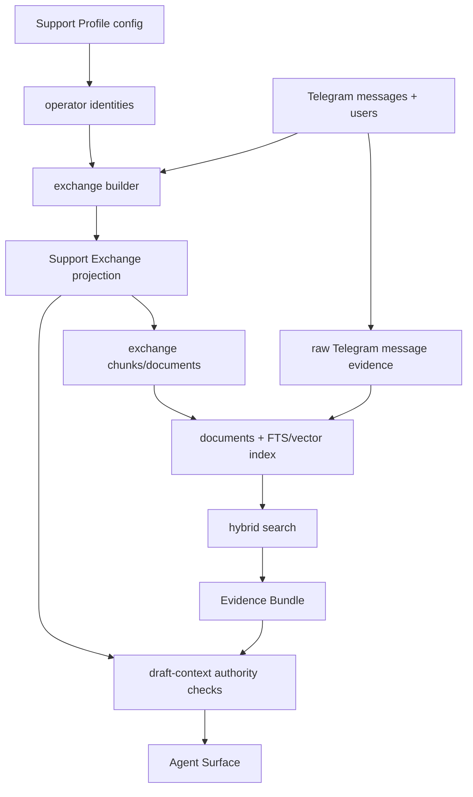
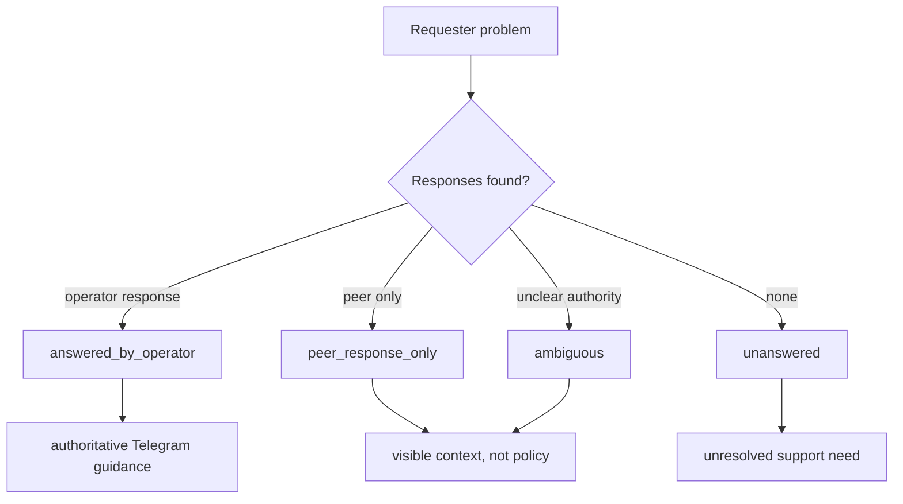

# feat: Add Support Exchange retrieval

## Summary

Add a rebuildable Support Exchange projection for Telegram evidence. Raw Telegram messages remain authoritative, while search and draft context can return grouped requester problems with operator, peer/community, and ambiguous response candidates.

---

## Problem Frame

Telegram chunks currently include neighboring messages so terse support messages have usable context. That context is useful for retrieval, but result metadata still belongs to the center message, so a hit on a neighbor message can appear under the wrong author.

The same proximity model is unsafe for answer authority. Non-operator participants may answer each other, so retrieval needs to separate requester problems, operator responses, peer/community responses, and unresolved exchanges before draft context can rely on prior Telegram answers.

---

## Requirements

**Exchange Shape**

- R1. The Local Core derives Support Exchanges without deleting or replacing raw Telegram message evidence.
- R2. Each exchange preserves source message IDs, authors, timestamps, text, and role labels for included messages.
- R3. Exchanges may include multiple response candidates and may remain partial when no reliable answer exists.
- R4. Exchange grouping exposes confidence or ambiguity instead of forcing unclear turns into an answered state.

**Authority and Attribution**

- R5. Response candidates are labeled as operator, peer/community, or ambiguous.
- R6. Only configured operator identities can produce authoritative Telegram answer evidence.
- R7. Search results identify the matched message or exchange role instead of attributing a multi-author context to one author.
- R8. Evidence output distinguishes requester problems from operator responses and peer/community responses.

**Retrieval and Drafting**

- R9. Search can return Support Exchange evidence when an exchange gives better context than a raw message alone.
- R10. Search can still return raw Telegram message evidence when no reliable exchange exists.
- R11. Operator-answer evidence ranks as stronger support guidance than peer/community responses for the same topic.
- R12. Draft context does not use peer/community responses as authoritative support truth without corroborating operator, Manual Knowledge, web, or Repository Evidence.
- R13. Unanswered exchanges remain discoverable as unresolved support needs.

---

## Key Technical Decisions

- KTD1. **Operator identity is profile configuration:** Authority cannot be inferred from message order, so the support profile should store the handles or display names treated as operators.
- KTD2. **Support Exchanges are a rebuildable projection:** Source messages stay durable, and exchanges can be rebuilt after sync, config changes, or index changes.
- KTD3. **Use explicit reply links first, then conservative turn grouping:** Telegram `reply_to_message_id` gives high-confidence pairings; nearby-turn grouping is useful only when it can preserve ambiguity.
- KTD4. **Index exchange evidence as an `exchange` source type:** Exchange retrieval should improve support-context recall without removing exact raw-message attribution, and the source type should make exchange evidence distinguishable from raw Telegram messages.
- KTD5. **Draft safety lives in the Local Core response shape:** Agent Surfaces should receive authority labels and warnings from `draft-context` rather than independently deciding which Telegram responses are support truth.

---

## High-Level Technical Design

Support Exchanges are derived after message sync and before document rebuild. The exchange projection carries structured roles and authority labels; the document projection keeps raw messages and exchange records searchable through the existing hybrid retriever.

The lifecycle keeps useful imperfect data. Peer-only and ambiguous exchanges are still searchable, but draft context must not treat them as settled support guidance.

---

## Implementation Units

### U1. Operator identity profile configuration

- **Goal:** Add profile-level operator identities that the Local Core can use to label authoritative Telegram responses.
- **Requirements:** R5, R6
- **Dependencies:** None
- **Files:** `tg_support/config.py`, `tg_support/cli.py`, `tests/test_config.py`, `tests/test_cli_setup.py`, `README.md`, `docs/setup.md`, `skills/telegram-support/SKILL.md`
- **Approach:** Extend support profile config with an optional list of operator identities normalized like Telegram author identities. Add setup and status JSON visibility so operators can see whether authoritative exchange classification is enabled.
- **Execution note:** Start with config round-trip tests before changing CLI setup output.
- **Patterns to follow:** Repository Evidence setup is optional, profile-local, visible in status, and documented in thin agent surfaces.
- **Test scenarios:**
  - Given setup receives operator identities, config persists them under the profile directory and status returns them in a redaction-free metadata field.
  - Given no operator identities are configured, setup still succeeds and status remains usable for normal search.
  - Given duplicate identities differ only by case or leading `@`, config stores one normalized identity.
  - Given an invalid blank operator identity is provided, setup fails with structured JSON rather than writing a bad profile.
- **Verification:** Config and CLI tests prove operator identity configuration is optional, normalized, profile-local, and visible to downstream exchange building.

### U2. Support Exchange storage projection

- **Goal:** Add durable schema support for a rebuildable exchange projection linked back to raw Telegram messages.
- **Requirements:** R1, R2, R3, R4
- **Dependencies:** U1
- **Files:** `tg_support/storage/schema.py`, `tg_support/storage/db.py`, `tests/test_storage.py`
- **Approach:** Add schema versioning for exchange records, exchange message members, and an `exchange` source type allowed in the rebuildable chunk/document projection. Store exchange status, confidence, role, authority label, and source message links while keeping raw `messages` as the source of truth.
- **Patterns to follow:** The `documents` projection is rebuilt from chunks and source metadata; migrations preserve existing source tables.
- **Test scenarios:**
  - Given an initialized database, exchange projection tables exist and raw messages still insert normally.
  - Given exchange evidence is chunked or projected, the database accepts `exchange` as a source type without weakening existing `telegram`, `web`, and `manual` source checks.
  - Given legacy schema version 3 data, initialization migrates to the new schema without deleting messages, chunks, documents, drafts, or index runs.
  - Given an exchange is rebuilt twice from the same source messages, old exchange projection rows are replaced idempotently.
  - Given exchange members are stored, each member points back to a raw Telegram message and preserves the message role and authority label.
- **Verification:** Storage tests prove exchange projection state is rebuildable and source-linked.

### U3. Exchange derivation from replies and turns

- **Goal:** Build Support Exchanges from Telegram reply links and conservative nearby-turn grouping.
- **Requirements:** R2, R3, R4, R5, R6, R13
- **Dependencies:** U1, U2
- **Files:** `tg_support/indexing/exchanges.py`, `tg_support/storage/db.py`, `tests/test_exchanges.py`, `tests/conftest.py`
- **Approach:** Create an exchange builder that first pairs operator replies with referenced requester messages, then groups simple adjacent requester/response turns when reply links are absent. Label configured operator responses as operator, non-operator responses as peer/community, and unclear cases as ambiguous or unanswered.
- **Execution note:** Implement this test-first around small synthetic conversations with explicit `reply_to_message_id`.
- **Patterns to follow:** `tg_support/indexing/chunking.py` already derives rebuildable rows from message-author rows; `tg_support/support/stats.py` already joins replies back to parent messages.
- **Test scenarios:**
  - Covers origin F1 / AE3. Given a Support User question and a configured operator reply using `reply_to_message_id`, the exchange is `answered_by_operator` with requester and operator members.
  - Covers origin F2 / AE2. Given a peer response and later operator response to the same requester problem, both responses are included and authority labels differ.
  - Covers origin F3 / AE6. Given a requester problem with no operator response, the exchange is stored as unanswered and retrievable later.
  - Covers origin AE4. Given a conversation cannot be grouped confidently, raw messages remain ungrouped or ambiguous rather than forced into a false answered exchange.
  - Given the configured operator identity appears as a display name rather than username, authority labeling still recognizes it.
- **Verification:** Exchange tests cover reply-linked, peer-only, operator-later, unanswered, and ambiguous grouping behavior.

### U4. Index Support Exchanges as evidence documents

- **Goal:** Make Support Exchanges searchable through the existing document, FTS, and vector retrieval path.
- **Requirements:** R1, R7, R8, R9, R10, R11, R13
- **Dependencies:** U2, U3
- **Files:** `tg_support/indexing/chunking.py`, `tg_support/indexing/exchanges.py`, `tg_support/storage/schema.py`, `tg_support/storage/db.py`, `tg_support/indexing/hybrid.py`, `tests/test_chunking.py`, `tests/test_storage.py`, `tests/test_hybrid_retrieval.py`
- **Approach:** Create exchange-derived chunks/documents with source type `exchange` and metadata that preserves structured exchange roles. Keep raw Telegram chunks indexed, but let exchange evidence carry requester, response candidates, status, matched role, and authority metadata for better result attribution.
- **Patterns to follow:** Manual Knowledge Notes already add a non-Telegram source type to chunks and documents while preserving validity metadata and search priority behavior.
- **Test scenarios:**
  - Covers origin AE1. Given search matches a requester line inside an exchange, the returned evidence identifies that requester message author instead of only the center message author.
  - Covers origin AE3. Given peer and operator responses both match a query, operator-answer exchange evidence ranks above peer/community response evidence.
  - Given an exchange document is returned, `source_type` is `exchange` so consumers can distinguish it from raw Telegram message evidence.
  - Given no reliable exchange exists for a message, raw Telegram evidence still appears in search.
  - Given exchange metadata changes after operator identity config changes, index staleness detects the changed projection payload.
  - Given an exchange document is returned, its source IDs and metadata are enough to inspect the original Telegram messages.
- **Verification:** Hybrid retrieval tests prove exchange documents improve attribution and ranking without removing raw Telegram evidence.

### U5. Draft-context authority safety

- **Goal:** Ensure draft context treats exchange authority labels as evidence-sufficiency inputs.
- **Requirements:** R5, R6, R8, R11, R12, R13
- **Dependencies:** U4
- **Files:** `tg_support/support/context.py`, `tg_support/indexing/hybrid.py`, `tests/test_cli_setup.py`, `tests/test_hybrid_retrieval.py`
- **Approach:** Extend evidence sufficiency to recognize peer/community-only and ambiguous exchange evidence as insufficient for authoritative direct replies unless corroborating operator, Manual Knowledge, web, or Repository Evidence is present. Return warnings or reason codes that Agent Surfaces can display before drafting.
- **Patterns to follow:** Existing evidence sufficiency reasons already report weak evidence, missing user history, conflicts, and account-specific gaps.
- **Test scenarios:**
  - Covers origin AE5. Given draft context includes only peer/community response evidence for the support answer, sufficiency recommends a cautious or follow-up posture rather than a direct authoritative reply.
  - Given operator exchange evidence matches the request, direct-answer sufficiency can remain supported when no other gaps exist.
  - Given peer/community response evidence is corroborated by Manual Knowledge or Repository Evidence, draft context can show the peer response as context while relying on the authoritative source.
  - Given an unanswered exchange matches the request, draft context surfaces the unresolved state instead of inventing an answer.
- **Verification:** Draft-context tests prove exchange authority changes evidence sufficiency without weakening existing conflict and fallback behavior.

### U6. CLI indexing and setup integration

- **Goal:** Wire exchange building into normal operator commands and status flow.
- **Requirements:** R1, R6, R9, R10, R13
- **Dependencies:** U1, U2, U3, U4
- **Files:** `tg_support/cli.py`, `tests/test_cli_setup.py`, `README.md`, `docs/setup.md`
- **Approach:** Run exchange derivation during `index` after message chunking and before document rebuild. Include exchange counts in index output and setup/status documentation so operators understand that operator identities improve authoritative answer classification.
- **Patterns to follow:** `command_index` already chunks pages, Telegram messages, and Manual Knowledge Notes before calling the retriever build path.
- **Test scenarios:**
  - Given a ready profile with operator identities and reply-linked messages, `index` returns a successful JSON payload that includes exchange counts.
  - Given no operator identities are configured, `index` still succeeds and exchange output indicates no authoritative operator classification was possible.
  - Given new messages arrive after a prior index, status reports stale index until exchange and document projections are rebuilt.
  - Given exchange projection building fails due to invalid local data, CLI returns structured JSON and does not report a successful index.
- **Verification:** CLI tests prove the normal operator path builds exchanges and keeps actionable readiness semantics.

### U7. Agent Surface evidence presentation updates

- **Goal:** Teach thin Agent Surfaces how to present exchange evidence and authority warnings without duplicating Local Core logic.
- **Requirements:** R7, R8, R12, R13
- **Dependencies:** U5, U6
- **Files:** `skills/telegram-support/SKILL.md`, `skills/telegram-support/references/reply-workflow.md`, `skills/telegram-support/references/analytics-workflow.md`, `agents/claude.md`, `agents/openai.yaml`, `tests/test_cli_setup.py`
- **Approach:** Update workflow docs to show requester problems, operator responses, peer/community responses, unanswered exchanges, and authority warnings from CLI JSON. Keep posting confirmation unchanged.
- **Patterns to follow:** The current skill already treats `evidence_sufficiency`, `conflicts`, `fuzzy_author_candidates`, and `target.language` as Local Core facts to display before drafting.
- **Test scenarios:**
  - Given `draft-context` returns peer/community-only exchange evidence, skill docs require showing the authority warning before drafting.
  - Given exchange evidence contains requester and operator response metadata, skill docs instruct the agent to summarize both without collapsing authors.
  - Given unanswered exchange evidence appears in analytics, workflow docs allow reporting it as unresolved support need.
  - Given posting follows an exchange-backed draft, docs still require exact draft text, evidence summary, and explicit post/cancel confirmation.
- **Verification:** Documentation tests prove Codex, Claude, and OpenAI surfaces remain thin and share the Local Core authority semantics.

---

## Scope Boundaries

- This plan does not remove raw Telegram message retrieval or raw message IDs.
- This plan does not require perfect classification of every Telegram turn.
- This plan does not make peer/community responses authoritative.
- This plan does not add a public ticketing workflow.
- This plan does not change Manual Knowledge or Repository Evidence authority.

### Deferred to Follow-Up Work

- Add operator UI or command affordances for manually correcting exchange grouping.
- Add richer topic clustering over unanswered exchanges.
- Add cross-chat or multi-operator collaboration semantics beyond profile-local operator identity configuration.

---

## System-Wide Impact

This change affects profile configuration, SQLite schema, rebuildable indexing projections, hybrid retrieval, draft context, and agent-facing workflow docs. It should stay inside the shared Local Core with thin surfaces consuming JSON facts.

Existing profiles will need re-indexing after the feature ships. If operator identities are added after indexing, the profile should rebuild exchanges and documents so authority labels and ranking reflect the new configuration.

---

## Risks & Dependencies

- **Operator identity ambiguity:** Display names are not unique. Mitigate by allowing multiple configured identities and keeping ambiguous exchange states visible.
- **False exchange grouping:** Nearby turns can imply relationships that do not exist. Mitigate by preferring reply links and marking uncertain groups partial or ambiguous.
- **Ranking regressions:** Exchange documents may crowd out raw source evidence. Mitigate with tests that raw Telegram evidence remains available and operator responses outrank peer/community responses only when authority is known.
- **Schema migration risk:** This adds persistent projection tables. Mitigate with migration tests from the current schema version and idempotent rebuild behavior.
- **Agent prompt drift:** Exchange authority is only safe if all surfaces present it consistently. Mitigate by updating Codex, Claude, and OpenAI instructions together.

---

## Acceptance Examples

- AE1. Given search matches `Snuglyni` inside exchange evidence, the result identifies `Snuglyni` as the matched requester message author rather than attributing the text to a center message author.
- AE2. Given a non-operator participant answers another support user's question, that response is labeled peer/community and is not treated as authoritative support truth.
- AE3. Given both a peer participant and configured operator respond to the same requester problem, both responses may be visible while the operator response is distinguished as stronger guidance.
- AE4. Given Telegram messages cannot be grouped with enough confidence, raw message evidence remains available and no false answered exchange is created.
- AE5. Given draft context includes a peer/community response matching the query, the Agent Surface does not rely on that response as policy without corroborating evidence.
- AE6. Given a Support User asks a question and no operator response exists, search can surface the unanswered exchange as an unresolved support need.

---

## Documentation / Operational Notes

Setup docs should explain that operator identities improve authority classification for Support Exchanges. Existing profiles can continue searching without this setting, but operator-answer evidence cannot be labeled authoritative until identities are configured.

Operator command names should stay stable. The normal path remains setup, sync, index, search, draft-context, draft-create, and confirm.

---

## Sources / Research

- `docs/brainstorms/2026-06-26-support-exchange-retrieval-requirements.md` defines the origin requirements, flows, and acceptance examples.
- `CONCEPTS.md` defines Support Exchange, Evidence Bundle, Manual Knowledge Note, Repository Evidence, and the Local Core boundary.
- `tg_support/storage/schema.py` stores source Telegram messages, reply links, chunks, documents, drafts, and confirmation state.
- `tg_support/storage/db.py` provides message-author rows, document rebuilds, FTS enrichment, and author identity lookup patterns.
- `tg_support/indexing/chunking.py` currently builds Telegram chunks from neighboring message windows.
- `tg_support/indexing/hybrid.py` owns hybrid retrieval ranking, Manual Knowledge priority, conflict checks, and result shaping.
- `tg_support/support/context.py` owns draft-context history, thread, evidence sufficiency, and fallback reason codes.
- `docs/solutions/architecture-patterns/thin-agent-surfaces-shared-local-cli-core.md` requires support behavior to live in the shared Local Core while skills and companion agents stay thin.
